# Midjourney Hesap Açma

İlk olarak https://midjourney.com sitesine girip sağ alttaki "Sign Up" düğmesine basıyoruz.

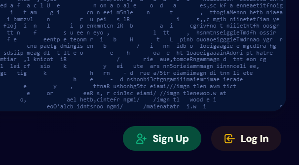

"Continue with Discord" düğmesiyle ilerliyoruz. (Discord.com sitesinden hesap açmamız gerekiyor)

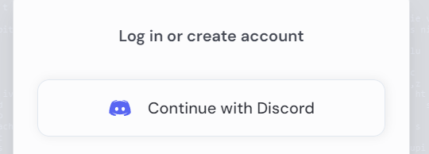

Kullanıcı adımızı belirliyoruz ve robot kontrol testini aşıyoruz.

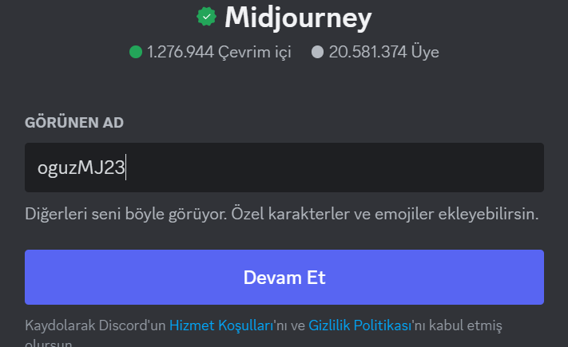

Doğum günümüzü giriyoruz ve eposta, şifremizi girerek hesabımızı oluştuyoruz.

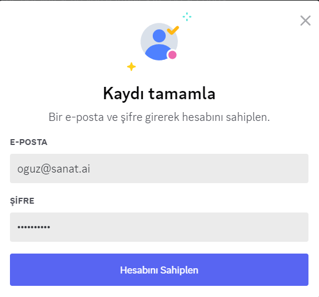

Hesabımıza gelen doğrulama e-postasındaki bağlantıya girerek hesabımızı onaylıyoruz.

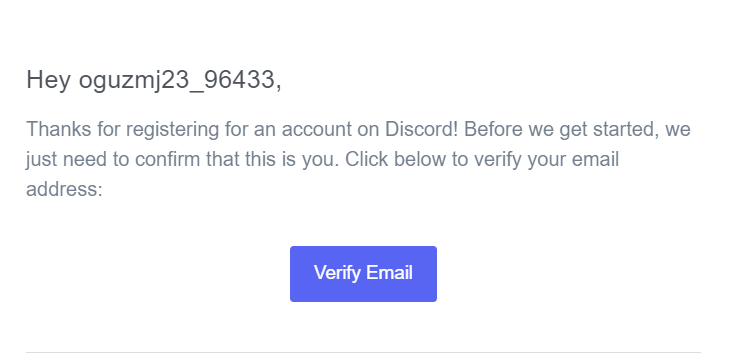

Hesabımızı onayladıktan sonra discord.com'a devam ediyor ve en soldaki menüden "+" düğmesine basarak bir sunucu oluşturuyoruz.

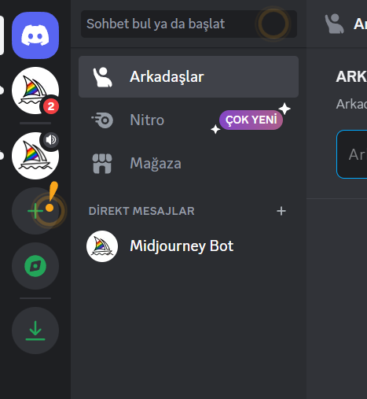

"Kendim oluşturayım" seçeneği ile devam ediyoruz.

"Benim ve arkadaşlarım için" seçeneği ile devam ediyoruz.

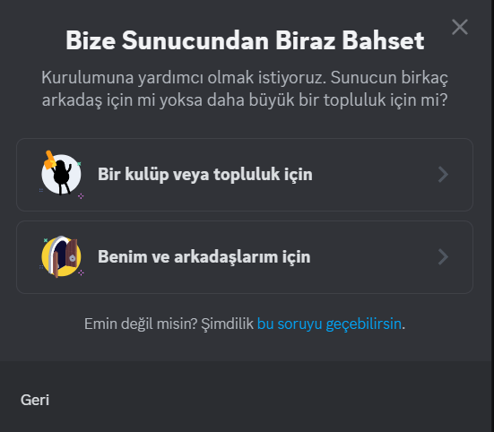

Sunucumuza isim veriyoruz ve oluştur düğmesi ile sunucumuzu oluşturuyoruz. 

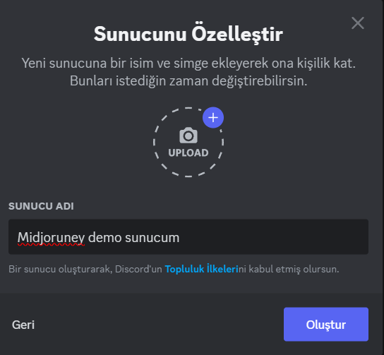

Şimdi Midjourney botunu bu sunucumuza ekleyeceğiz.
Bunun için soldaki sunucu ikonlarından "Midjourney'in" logosu olan küçük yat ikonuna basıyoruz.

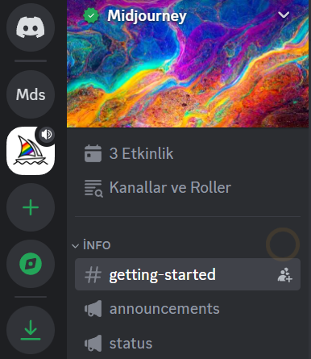

Sağ yukardaki "Üye listesini göster" ikonuna basıp üyeleri listeliyoruz.

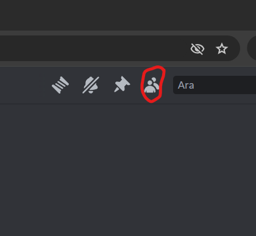

Sağ tarafta açılan listede "Midjourney Bot" kullanıcısına sol tuşla basıyoruz ve açılan pencerede "Uygulamaya Ekle" düğmesine basıyoruz.

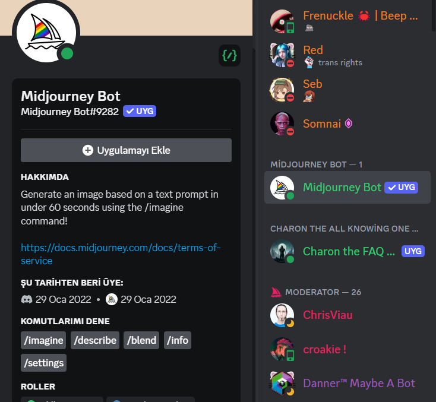

"Sunucuya ekle" seçeneğini seçiyoruz

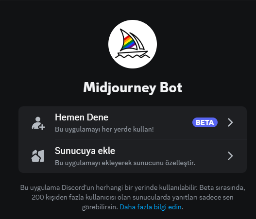

Daha önce oluşturduğumuz sunucuyu alttaki "bir sunucu seç" açılır listesine basarak seçiyoruz

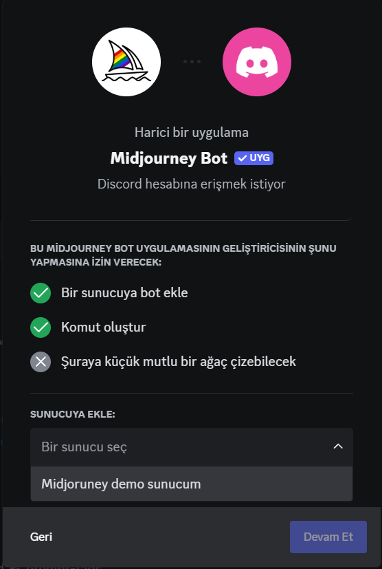

Tüm yetkileri vererek "Yetkilendir" düğmesine basıyoruz. 

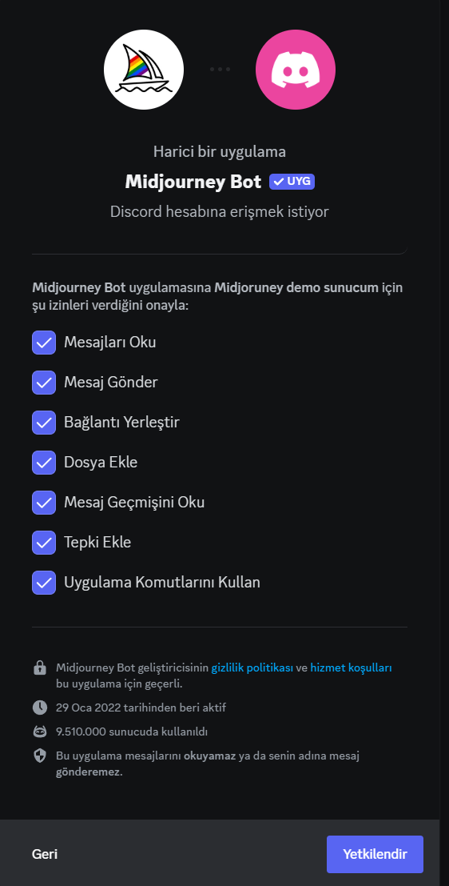

Tekrar robot kontrolünü geçerek "Midjourney demo sunucusuna git" düğmesine basıyoruz. (Dilerseniz sol taraftaki sunucu ikonumuzdan da gidebilirisiniz)

Sunucumuza girdikten sonra altta çıkan chat alanına /imagine yazıyor ve "tab" ya da "space" tuşuna basıyoruz

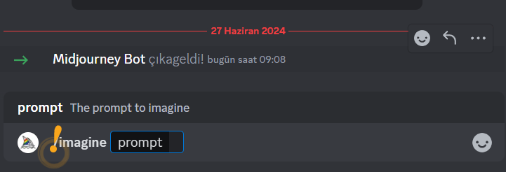

Prompt olarak "a retro car" gibi bir iafe girin.

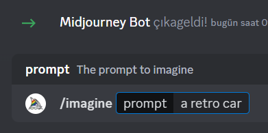

Midjourney artık ücretsiz olarak kredi vermediği için abonelik yapmanız gerektiği için sizi uyarı mesajı açacak, burdaki "Subscribe" düğmesine basıyoruz ve yeni açılan alandaki manage account düğmesine basarak "midjourney.com" sitesine gidiyoruz.

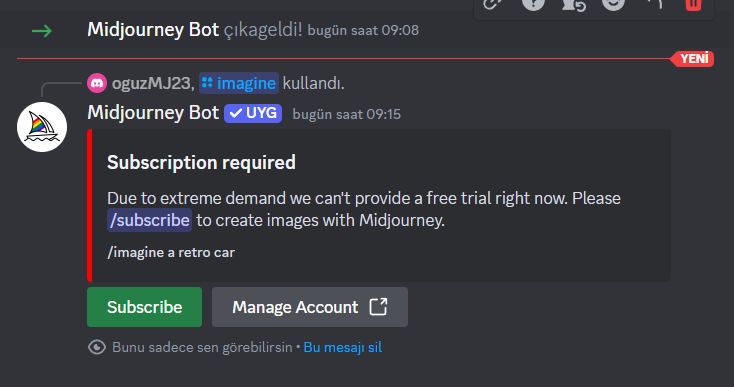

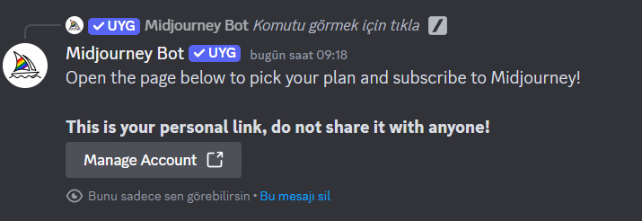

Şimdi öncelikle aylık ödeme yapmak için "Monthly billing" seçeniğine basıyor ve Basic Plan altındaki "Subscribe" Düğmesine tıklıyoruz.

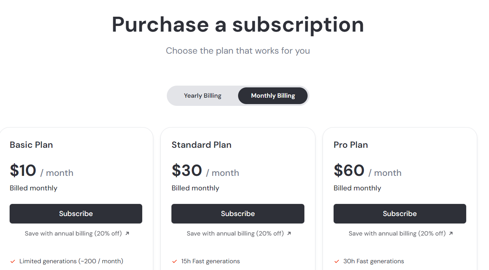

Midjourney "stripe" ödeme platformunu kullanıyor. (Dünyanın en bilinen ödeme platformlarındandır)

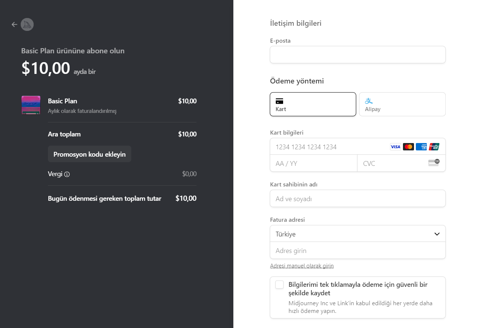

Kredi kartı bilgilerimi girip "Abone ol" düğmesine basıyoruz.

Ödemeniz başarıyla tamalandıktan sonra tekrar "discord" altındaki chat alanına gidiyoruz ve promptumuzu tekrar çalıştırıyoruz.

Midjourney "Kullanım koşulları" uyarısı çıkarırsa onaylıyoruz ve görselimiz oluşturuluyor.

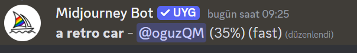

Herhangi bir sorun ile karşılarsanız "issues" bölümünden yazabilirsiniz.

