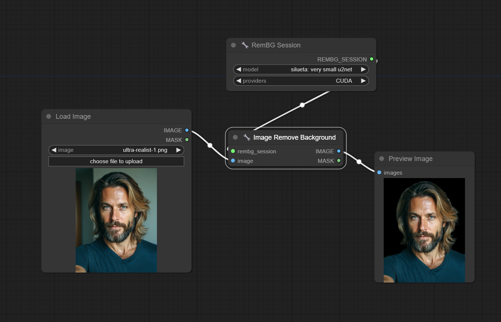

<a href="/">< Dizine dön</a> | <a href="/ornekler">< Örneklere dön</a>

Bu örneğimizde yapay zeka ile herhangi bir görselin arkaplanını ücretsiz olarak temizlemeyi göreceğiz. 

Örneğimizde ComfyUI kullandık, ilk olarak ComfyUI uygulamızı açarak Manager'ı açıyoruz ve "Install Custom Node" diyerek arama kısmına "essentials" yazıyoruz.

Listelenen node'lardan cbuiq adlı kullanıcıya ait kütüphaneyi "install" diyerek kuruyoruz ve ComfyUI uygulamamızı yeniden başlatıyoruz.

Bu aşamada görseldeki akışı oluşturmak için [workflow](../gorseller/workflow/remove-bg.json)'umumuzu yüklüyoruz.

Son olarak "Load Image" node'una arkaplanını temizlemek istediğimiz görselimizi seçerek "Queue Prompt" düğmemize basıyoruz.

Sonuç bu şekilde oluştu;

RemBG Session bölümünde listelenen modelleri değiştirerek farklı obje/nesnelerde daha iyi sonuçlar alabilirsiniz.

