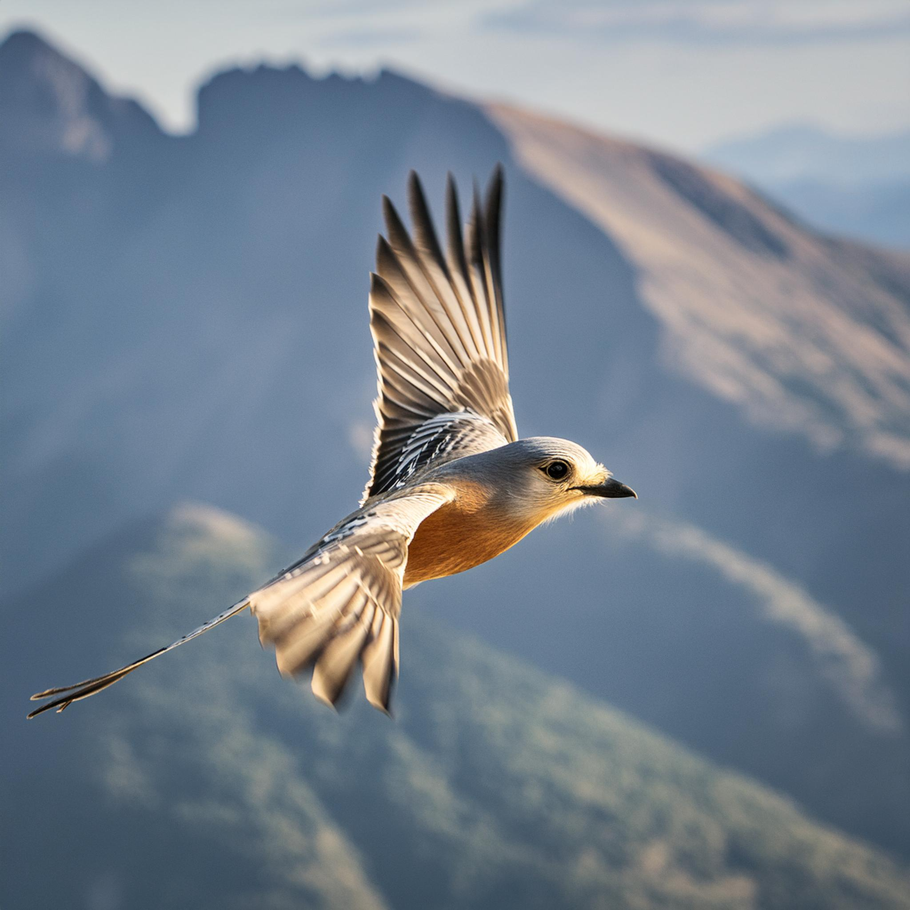

<a href="/">< Dizine dön</a> | <a href="/ornekler">< Örneklere dön</a>

# Çizimlerinizi fotoğrafa dönüştürün

Bu çalışmamızda elle ya da dijital oluşturmuş bir çizi gerçek görsele dönüştüreceğiz. Çalışmamız Stable Diffusion ve Firefly kullandık. Maalesef 2024 Mayıs itibariyle Midjourney bu konuda hala iyi durumda değil.

# Stable Diffusion

Görselimizi fotoğrafa dönüştürmek için "Canny" modelini kullanacağız. Çizim olarak pixabaydan indirebileceğiniz bu kuş görselini kullandık. https://pixabay.com/illustrations/bird-hummingbird-drawing-nature-7553736/

Controlnet ayarlarımız bu şekilde, dilerseniz Canny yerine lineart da kullanabilirsiniz.

`RAW photo of a bird, flying, masterpiece, 8k, fujifilm, depth of field`

Negatif promptlarımız;

`drawing, painting`

Sonuç fotoğraflarımız böyle oluştu.

# Firefly

İlk olarak yapı alanına yukardaki görselimizi ekliyoruz ve kuvvet değerini maksimuma getiyoruz.

Promptlarımı;

`a realistic bird photo, flying`

Sonuç. (Çizimin detayları çok olduğunda firefly iyi sonuç veremeyebiliyor ve kuş görselimizin kanatlarındaki detayları Firefly'ı zorladı)

# Midjourney
