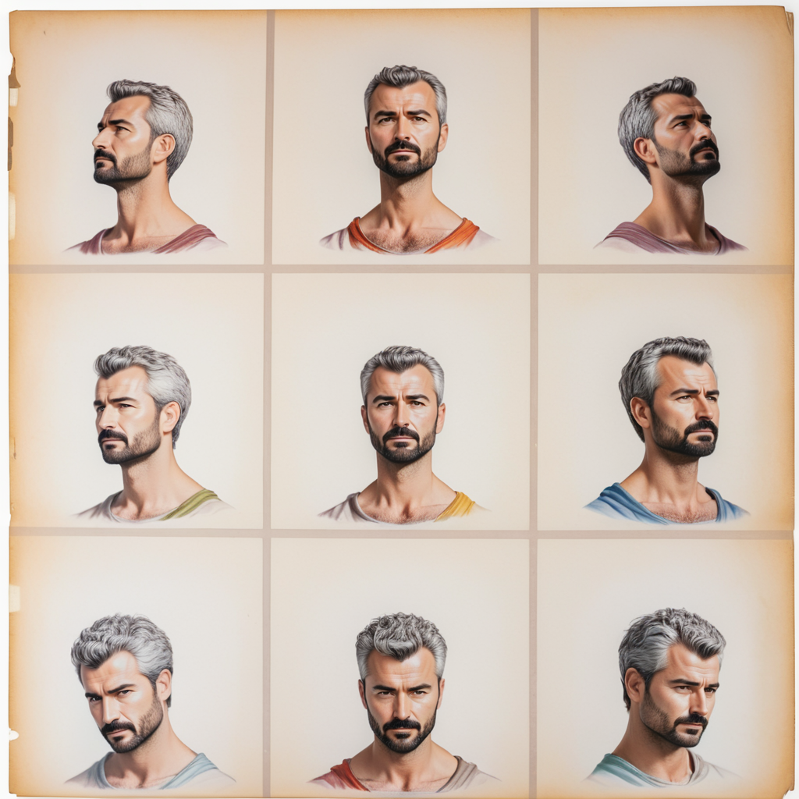

<a href="/">< Dizine dön</a> | <a href="/ornekler">< Örneklere dön</a>

# Çoklu poz ile karakter üretimi (Oyun ve sanaryolarınız için)

Üretken yapay zekanın en çok kullanıldığı alanlardan biri de şüphesiz oyun sektörü. Bu yazımızda tek bir fotoğraf ile oyun ve senaryolarınız için tek bir fotoğrafla nasıl çoklu karakter üretimi yapabileceğimizi görüyoruz. Dersin sonundaki linki takip ederek oluşturduğumuz karakteri isterseniz 3D bir modele de dönüştürebilirsiniz.

Dersimiz diğer derslere nazaran biraz daha zor ancak bir kez oluşturduktan sonra workflow'u kaydederek kolaylıkla karakterler üretebilirsiniz.
Yazımızda ComfyUI kullanacağız ama benzer bir yöntemle A1111 ile de çoklu poz üretebilirsiniz. ComfyUI kurulumu için [bu dersimize](../kurulumlar/comfyui.md) bakabilirsiniz.

ComyfyUI uygulamamızı çalışdırtıktan sonra [bu workflow](../gorseller/workflow/consistent_character_comfyui.json)'u yüklüyoruz (sürükle bırakla ekrana bırakabilirsiniz.)

Dersimizin kaynak alındığı makale için [bu adrese ](https://stable-diffusion-art.com/consistent-character-view-angle/#Extensions)bakabilirsiniz.

Daha sonra ComfyUI manager'dan "Install Missing Nodes" diyerek gerekli node'ları kuruyoruz ve ComfyUI uygulamamızı yeniden başlatıyoruz.

Model olarak ProtoVisionXL modelini kullandık https://civitai.com/models/125703/protovision-xl-high-fidelity-3d-photorealism-anime-hyperrealism-no-refiner-needed

Kişi detaylarını çıkarmak için Controlnet Canny modelini https://huggingface.co/lllyasviel/sd_control_collection/blob/main/diffusers_xl_canny_mid.safetensors

ComfyUI dizininde models\controlnet dizinine yüklenmeli

Yüzünü benzetmek için ise IpAdapter FaceID Plus2 modelini kullandık https://huggingface.co/h94/IP-Adapter-FaceID/blob/main/ip-adapter-faceid-plusv2_sdxl.bin

ComfyUI dizininde models\ipadapter dizinine yüklenmeli

Workflow'umuzu çalıştırmadan önce insightface yüklemeniz gerekebilir. Eğer insightface ile ilgili bir hata alırsanız, ComfyUI'yı çalıştdığınız ekranda 

`pip install insgihtface` komutu ile bunu gerçekleştirebilirsiniz. 

Windows üzerinde ayrıca C++ VS build tool'su da yüklemeniz gerekebilir.  https://visualstudio.microsoft.com/tr/visual-cpp-build-tools/

Bu noktada kurulum yapılerken detaylara girerek Windows 10 SDK ve Build Tools V142'nin için seçim yapıldığından emin olunuz.

Workflow'umuzda controlnet alanımıza [bu adreste](../gorseller/character_sheet_3x3b.webp) bulabileceğiniz görselimizi ekliyoruz.

Daha sonra ip adapter alanında çoklu poza dönüştürmek istediğimiz fotoğrafımızı giriyoruz.

Son olarak pozumuz için gerekli promptlarımızı girip "Queue Prompt" düğmesine basıyoruz.

`character sheet, color photo of man, white background`

Görselimiz bu şekilde oluşturuldu.

Oluşturduğumuz görsellerden herhangi birini tripo3d.ai üzerinden bu [bu dersimizdeki](iki-boyutlu-gorselleri-uc-boyutluya-donusturun.md) gibi 3D hale dönüştürebilirsiniz. 

[Video](/gorseller/19-48-01.mp4)

