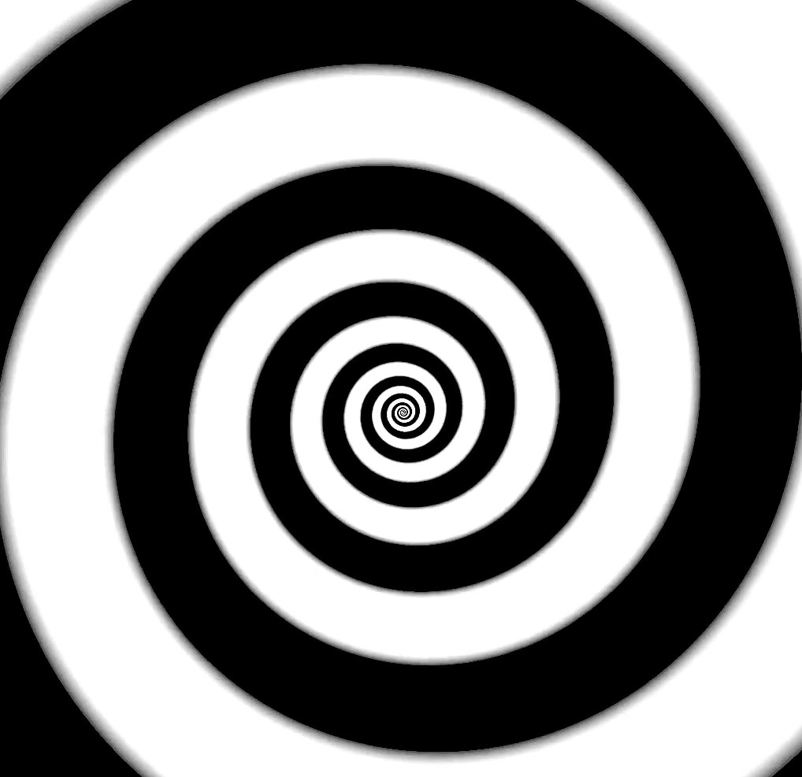
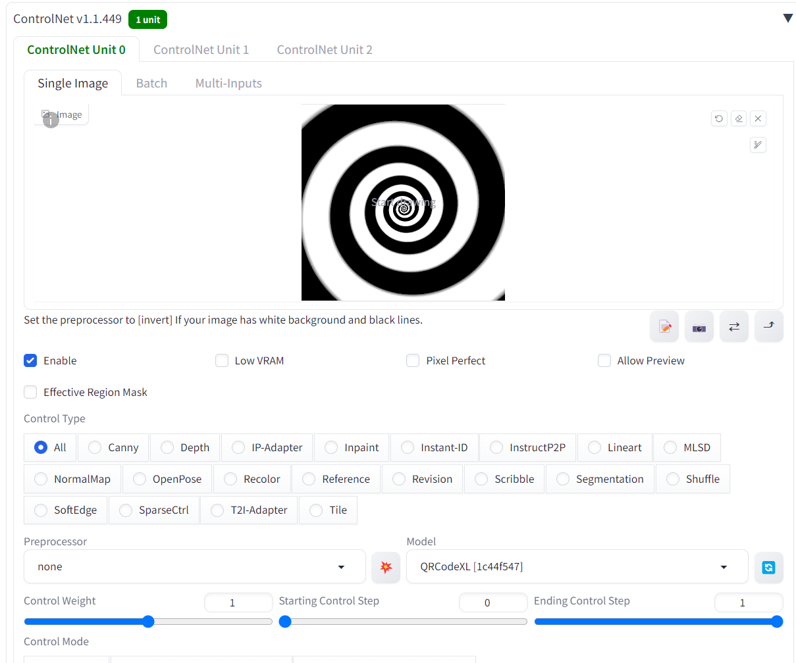
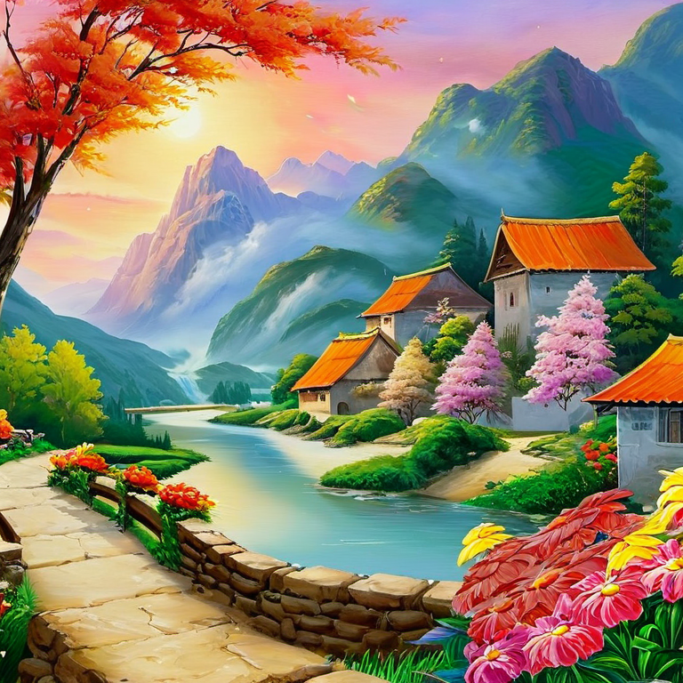
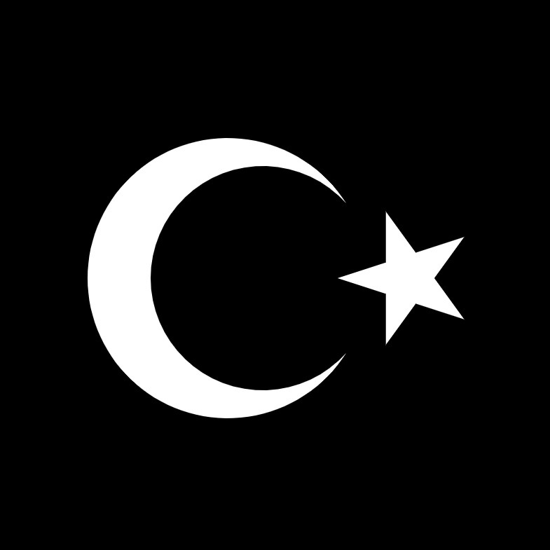
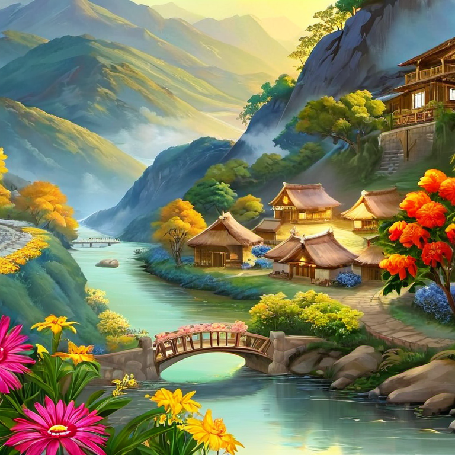
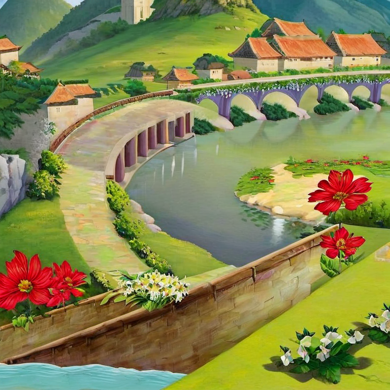

<a href="/">< Dizine dön</a> | <a href="/ornekler">< Örneklere dön</a>

# Desen kullanarak fotoğraf oluşturma (subliminal görsel oluşturma)

Yapay zeka ile verdiğiniz bir desen tarzından görsel oluşturmak ister misiniz? Bir spiral bir dama tahtası ya da Türkiye Cumhuriyeti bayrağı, istediğiniz herhangi bir şekli yapay zekaya vererek görseliniz çizgileriyle resimler/fotoğraflar oluşturabilirsiniz. Gelelim nasıl yapılacağına; örneğimizde Stable Diffusion (A1111) yardımıyla bu tip görseller oluşturacağız.

İlk olarak A1111 üzerinden Controlnet'in kurulu olması gerekiyor. Controlnet kurulumu için sanat.ai adresindeki derslerimizi bakabilirsiniz.

Desenleri görsellerimize uygulamak için QRCodeMonster isimli controlnet modelini kullanacağız. Bu modeli bu adresten indirebilirsiniz https://huggingface.co/monster-labs/control_v1p_sdxl_qrcode_monster/blob/main/diffusion_pytorch_model.safetensors

Modelimizi "extensions\sd-webui-controlnet\models" dizinine QRCodeXL.safetensors adıyla kaydediyoruz.

A1111'i açarak txt2img sekmesine geliyoruz ve controlnet'ten paylaştığımız spiral deseni ile birlikte görseldeki ayarları yapıyoruz. Checkpoint olarak herhangi bir XL modeli kullanabilirsiniz, biz CrystalClear XL modelini kullandık.

Spiral desenini indirmek için 

Şimdi prompt alanına desenimiz baz alınarak hangi görselin oluşturulmasını istediğimizi promptlarımızla giriyoruz.

`a village painting, flowers, rivers, a bridge and mountain background, soft lights`

Negatif promptlarımız;

`blurry, photograph`

Sonuç;

Şimdi aynı promptları kullanarak bu kez Türkiye bayrağı ile görsel oluşturacağız. Bayrak görselimizi  indirebilirsiniz.

Sonuç;

Control weight ayarını arttırarak desenin daha net oluştuğu görseller oluşturabilirsiniz. 

(1.4)

