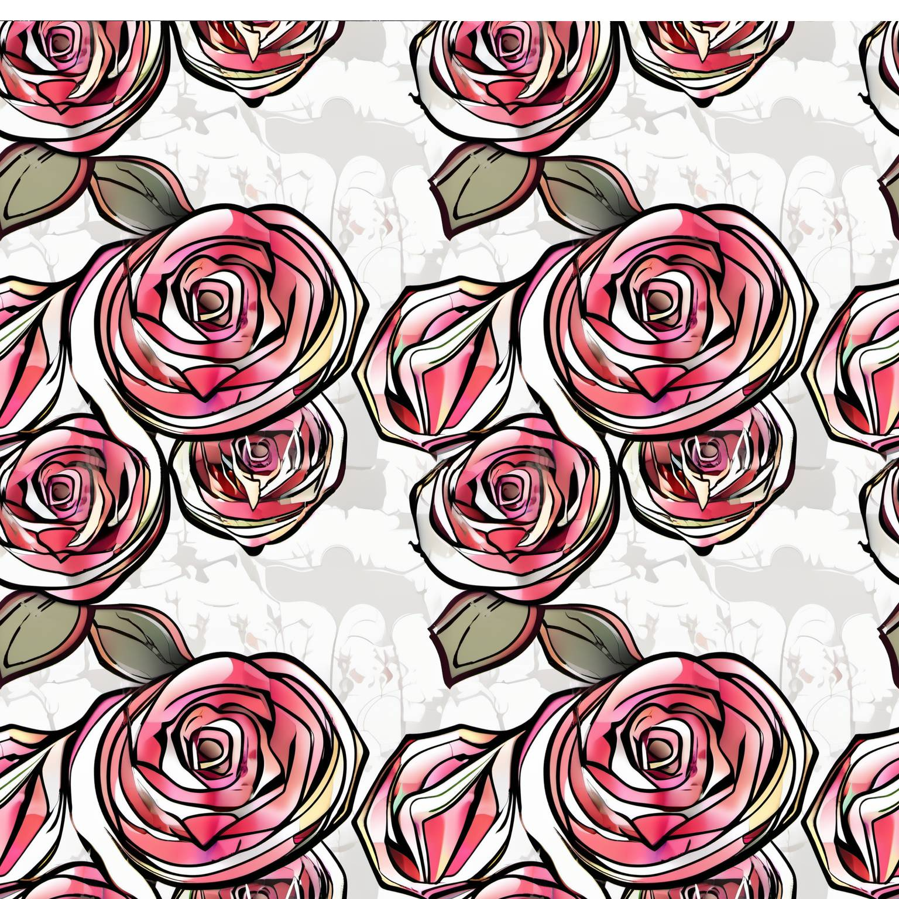

<a href="/">< Dizine dön</a> | <a href="/ornekler">< Örneklere dön</a>

# Yapay zeka ile tekrar eden desenler oluşturma

Bu örneğimizde gerek fiziksel ürünlerde gerekse dijital ürünlerinizde kaplama (texture) olarak kullanabileceğiniz desen (pattern) görsellerini nasıl üretebileceğinizi göreceğiz.

# Stable Diffusion

Stable Diffusion (A1111)'de tekrar eden görseller oluşturmak için ilk olarak "Settings" bölümüne girerek arama alanına "tile" yazıyoruz ve çıkan Tiling onay kutusunu onaylı hale getiriyoruz.

Daha sonra txt2img alanına giderek oluşturmak istediğimiz deseni prompt olarak tarif ediyoruz. Biz örneğimizde bir mermer deseni oluşturmayı deneyeceğiz.

Sonuç görselimiz;

# Midjourney

Midjourney'de pattern görseller oluşturmak çok daha kolay. Promptlarınızı yazdıktan sonra --tile parametresini vermeniz yeterli, promptumuzu ve oluşturduğumuz görselleri paylaşıyoruz.

`pattern, flowers, iran style --v 5.2 --tile`

