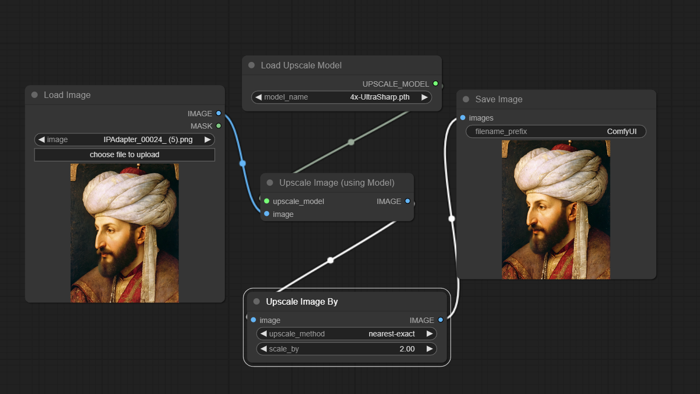
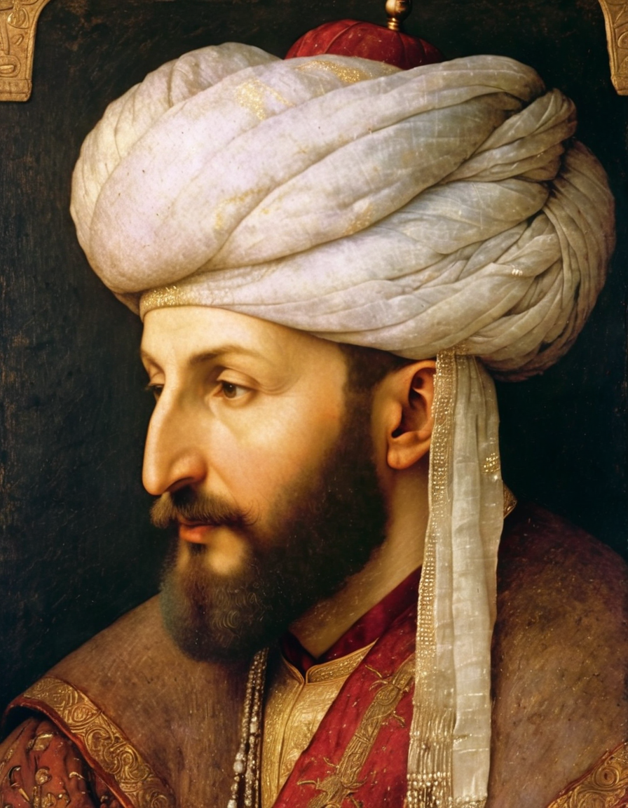

<a href="/">< Dizine dön</a> | <a href="/ornekler">< Örneklere dön</a>

# Yapay zeka ile fotoğraf büyütme (upscale)
Yapay zekanın en başarılı olduğu konulardan biri de ister yapay zeka ile üretilsin isterse gerçek bir fotoğraf olsun büyütme yapabilme. Kitabımızda basit ve pro (supir) olmak üzere iki farklı metod üzerinden yapay zeka ile fotoğraflarınızı nasıl büyüteceğinizi (upscale) anlatacağız. Örneklerimizde Stable Diffusion kullanacağız (ComfyUI ve A1111). Basit yöntem ile başlıyoruz;

İlk olarak basit yöntemimizde kullandığımız upscale modelimiz (Ultrasharp4+) [bu adresten](https://huggingface.co/lokCX/4x-Ultrasharp/blob/main/4x-UltraSharp.pth) indirerek

ComfyUI'da;
models\upscale_models 

A1111'de ise;
models\ESRGAN

Dizinine kopyalıyoruz ve uygulamamızı yeniden başlatıyoruz (A1111).

# ComfyUI üzerinde basit kullanım

ComfyUI üzerinde basit olarak kullanım için bu [workdflow](../gorseller/workflow/upscale-basit.json) yüklüyoruz ve LoadImage node'unda büyteceğiz fotoğrafı seçerek "Queue Prompt" düğmesiyle fotoğrafımızı upscale ediyoruz.

"Upscale Image By" node'unda scale_by seçeneği değiştirerek fotoğrafınız x kat büyütebilirsiniz (varsayılan olarak 2 kat seçili)

Upscale metod kısmında farklı seçenekleri deneyerek daha kaliteli sonuçlar alabilirsiniz.

Kaynak ve sonuç görsellerimiz bu şekilde oluştu;

Kaynak;

# A1111

A1111 webui'da büyütme için Extras sekmesine geçiyoruz ve Upscaler 1 alanında görseldeki gibi Ultrasharp seçeneğini işaretliyoruz.

Resim yükleme alanından görselimizi seçtikten sonra alt bölümdeki "Scale by" seçeneği ile kaç kat "scale to" seçeneği ile de hangi çözünürlüğe (pixel olarak) büyüteceğinizi belirleyebilirsiniz.

Daha sonra "Generate" düğmesiyle işleminizi başlatabilirsiniz.