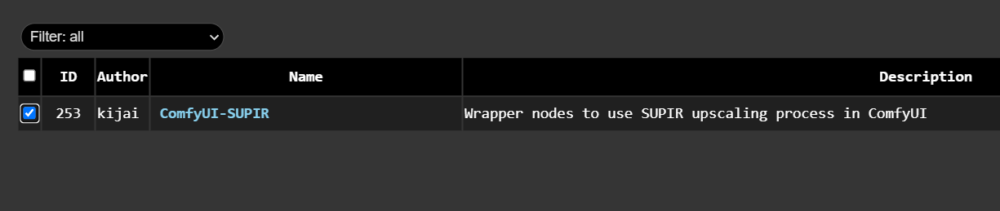
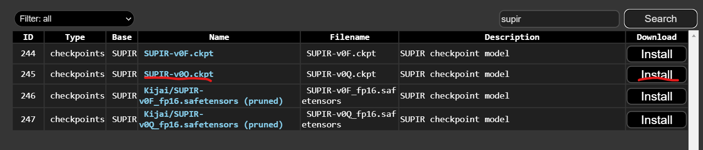
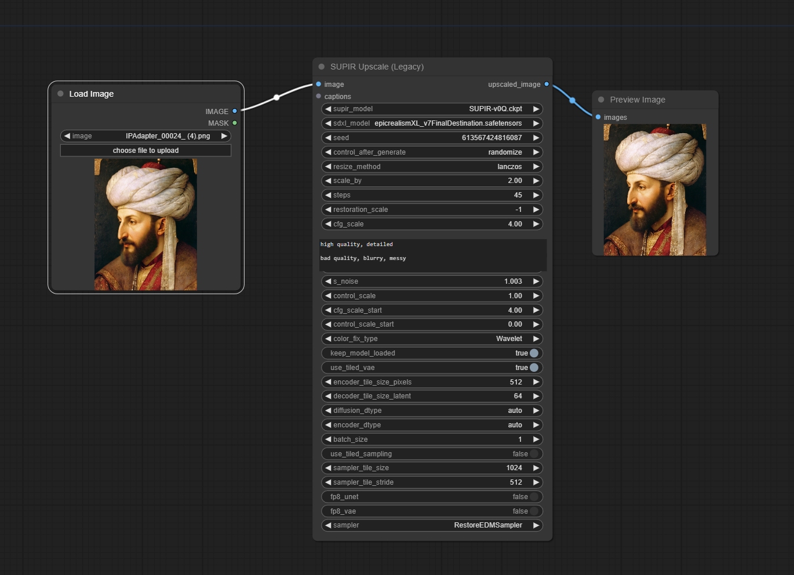
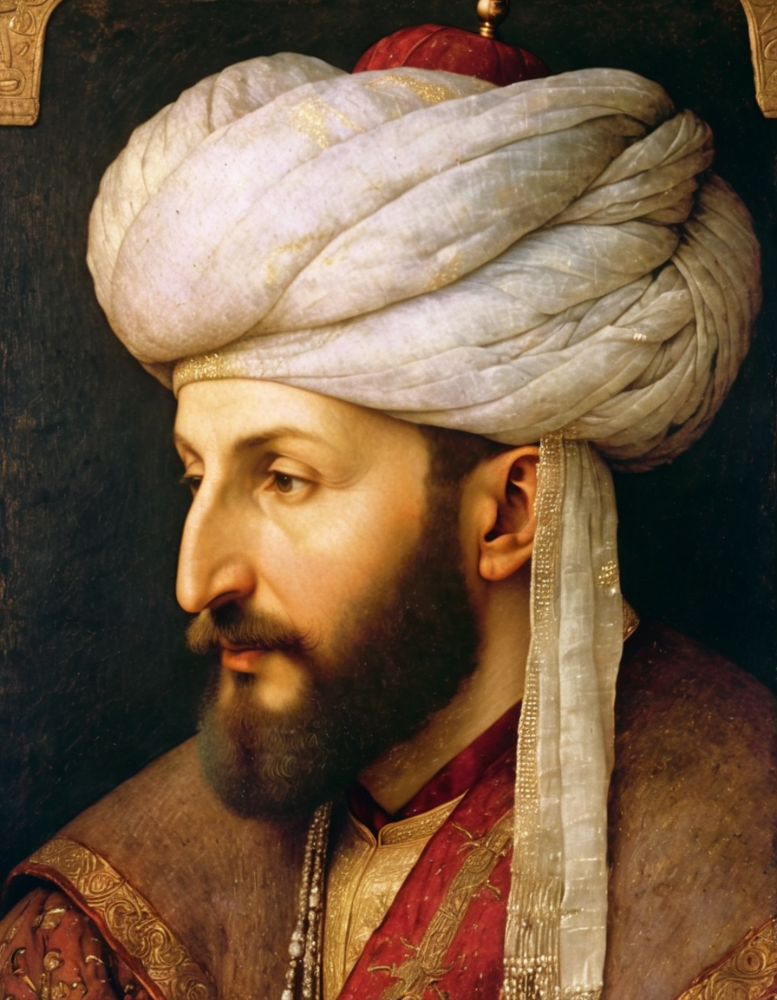

<a href="/">< Dizine dön</a> | <a href="/ornekler">< Örneklere dön</a>

# Yapay zeka ile kaliteli fotoğraf büyütme (ücretsiz)

Bir önceki örneğimizde basit bir yöntem ile yapay zeka ile nasıl fotoğraflarımızı büyütebileceğimizi görmüştük. Burada ise nispeten daha zor ama daha kaliteli olarak görsellerimizi nasıl büyüteceğimizi göreceğiz. Örneğimizde ComfyUI kullandık ancak A1111 için benzer bir yöntemi görmek için sanat.ai sitemizdeki https://sanat.ai/dersler/yapay-zeka-ile-g-rsellere-detay-ekleme bu derse bakabilirsiniz.

İlk olarak "Manager üzerinden" "Install custom node" bölümüne girerek arama alanına "supir" yazıyoruz ve "kijai" tarafından yayınlanan node'umuzu kuruyoruz.

ComfyUI tekrar başlattıktan sonra bu sefer manager'a girerek "Install Models" bölümüne girerek görseldeki gibi SUPIR-v0q.ckpt (5 GB büyüklüğünde) modelini kuruyoruz ve daha sonra "Refresh" düğmesine basıyoruz.

Workflowumuz ise bu şekilde, [buradan](../gorseller/workflow/upscale-supir.json) indirerek ComfyUI'da yükleyebilirsiniz.

Öncelikle supir model alanında indirdiğimiz modelin seçili olduğuna dikkat edelim. Supir sadece XL modellerle çalışmakta, dolayısıyla sdxl_model alanında bir XL modelini seçiyoruz.
Daha sonra scale_by seçeği ile kaç kat büyüteceğimizi belirtiyoruz. Başka bir ayarı şu aşamada değiştirmemize gerek yok. "Queue" prompt diyerek görselimizi büyütüyoruz.
Not: ekran kartınızın kapasitesine göre bu işlem 1-10 dakika arasında alabilir. Ayrıca A1111 üzerinde yaptığımız başka bir fotoğraf detaylandırma çalışması için bu videoyu izleyebilirsiniz https://sanat.ai/dersler/yapay-zeka-ile-g-rsellere-detay-ekleme

Sonuçlar bizde bu şekilde oluştu;

Kaynak görselimiz:

Sonuç görselimiz:

SUPIR kullanımı hakkında daha detaylı bilgi almak için bu adrese bakabilirsiniz;
https://github.com/Fanghua-Yu/SUPIR

