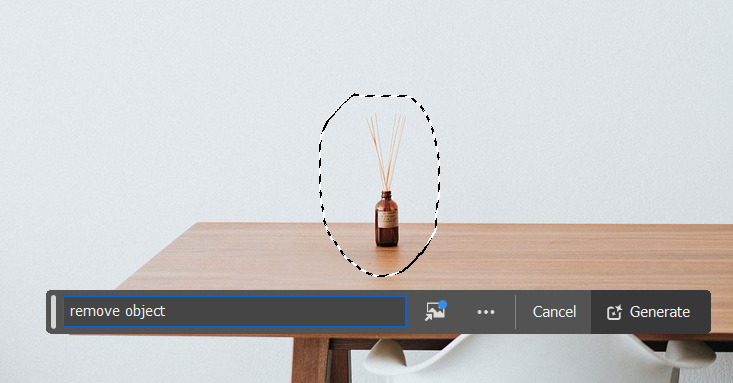

<a href="/">< Dizine dön</a> | <a href="/ornekler">< Örneklere dön</a>

# Yapay zeka ile fotoğraflar üzerinde değişiklik yapın.

Yapay zekanın en başarılı olduğu konulardan biri de fotoğrafların üzerinde istediğimiz değişiklikleri kolaylıkla yapmamızı sağlaması, daha önceleri sadece profesyoneller tarafından yapılabilen ya da yapılamayan şeyleri dakikalar hatta saniyeler içinde yapabilmeniz. Bu örneğimizde Adobe Photoshop ve Stable Diffusion üzerinden fotoğraflar üzerinde değişiklik yapacağız.

# Stable Diffusion ile fotoğraflar üzerinde değişiklik yapma (A1111)

Görsel düzenlemelerimizde herhangi bir modeli kullanabiliriz ancak inpaint için özelleştirilmiş modeller kullanarak daha başarılı sonuçlar alabilirsiniz. 
Biz örneğimizde [Juggernaut XL Inpainting ](https://civitai.com/models/403361/juggernaut-xl-inpainting) modelini kullanacağız. 

İlk olarak A1111'i açarak txt2img sekmesine girerek alt bölümden inpainting düğmesine basıyoruz ve fotoğraf yükleme alanından üzerinde değişiklik yapmak istediğimiz görselimizi yüklüyoruz.

Aynı fotoğraf üzerinde düzenleme yapmak isterseniz [buradan](https://pixabay.com/photos/apple-computer-browser-business-2568755/) indirebilirsiniz.

İlk olarak görselimizdeki koku şişesini masamızdan kaldıracağız. Bunun için ilgi görseli fırçamızla seçiyoruz ve daha sonra prompt alanına 

`clean table` yazıyoruz.

Dilerseniz ilgili alana daha büyük seçerek diğer ışık ve yansıma alanlarını da dahil edebilirsiniz.

Varsayılan ayarları olduğu gibi bırakıyoruz ve görselimizin ölçülerini almak için gönye ikonuna basıyoruz.

Görselinizde göre denoising ayarınızla oynayarak daha iyi sonuçlar elde edebilirsiniz. Biz bu sonucu elde ettik;

# Photoshop üzerine değişiklik

Benzer değişikliği yapmak ise Photoshop'ta nispeten daha kolay. Görselimizi lassa tool aracılığıyla seçtikten sonra generative fill alanına "remove object" promptunu yazarak Generate düğmesine bazıyoruz.

Sonucumuz bu şekilde oluştu.

