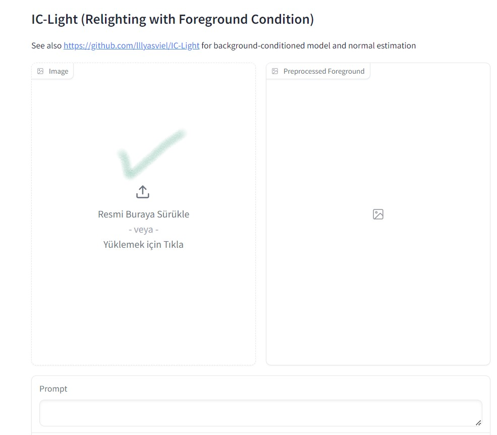

<a href="/">< Dizine dön</a> | <a href="/ornekler">< Örneklere dön</a>

Bu örneğimizda daha önce [Ürün Fotoğrafçılığı](urun-fotografciligi.md) bölümünde yaptığımız benzer bir çalışmayı kişi fotoğrafları üzerinde yapacağız.

Yapay zeka ışık ve arkaplanımızı ayarlayarak bize harika görseller oluşturma imkanı sağlayacak. Örneğimizde kullandığımız IC-Light projenizi bilgisayarınıza https://github.com/lllyasviel/IC-Light bu adresteki talimatları izleyerek kurabilirsiniz ancak biz kolaylık olması adına Huggingface'te projeye özel açılan bölümü (space) kullanacağız.

Space'e https://huggingface.co/spaces/lllyasviel/IC-Light buradan ulaşabilirsiniz.

İlk olarak üzerinde değişiklik yapacağımız görselimizi yükleme alanından yüklüyoruz.

Daha sonra yüklediğimiz fotoğraftaki kişinin cinsiyetine göre aşağıdan bir seçim yapıyoruz (opsiyonel)

Işık yönümüz ve atmosferi aşağıdaki düğmelerden seçerek belirliyoruz. (Farklı ışık ve ortamlar için elle yazabilirsiniz)

Daha sonra Relight düğmesine basarak görselimizi yeni ışıklandırmalarıyla oluşturuyoruz.

Baz aldığımız fotoğraf üzerinden oluşturulmuş bazı diğer görselleri promptları ile görebilirsiniz.

<strong>handsome boy,  sci-fi RGB glowing, cyberpunk</strong>

<strong>handsome boy,  shadow from window</strong>

<strong>handsome man, detailed face, sunshine, outdoor, warm atmosphere</strong>

