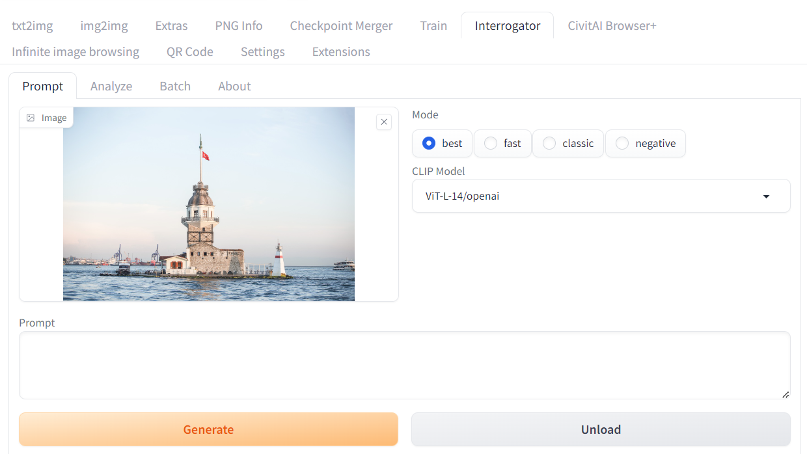

<a href="/">< Dizine dön</a> | <a href="/ornekler">< Örneklere dön</a>

# Fotoğraf içeriğini yapay zeka indeksletme (Profesyonel)

Daha önce basit bir çalışma üzerinden yaptığımız görsellerin promptlarını öğrenmeme çalışmamızı daha profesyonel bir araçla yapacağız. Örneğimizde Stable Diffusion (A1111) kullandık.

İlk olarak Extensions bölümüne giderek "Available" alt sekmesine giderek "Load from" düğmesine basıyoruz ve arama alanına "interrogator" yazarak aratıyoruz ve görseldeki gibi "Clip Interrogator" eklentisini install düğmesine basarak kuruyoruz. Kurulum tamamlandıktan sonra Installed alt sekmesine geçerek "Apply and restart UI" düğmesine basıyoruz.

Kurulum tamamlandıktan sonra yeni eklenen Iterrogator sekmesine giriyoruz ve indeksletmek (promptlarını tahmin etmek) istediğimiz görselimizi dosya yükleme alanına bırakıyoruz.

Daha sonra "Generate" düğmesine basarak yapay zekanın fotoğrafımızdaki öğeleri tahmin etmesini sağlıyoruz.

Yapay zeka görselimizi bu şekilde indeksledi.

`a lighthouse in the middle of the water, the fall of constantinople, trending on artforum, 2 0 1 2, interconnections, full width, neo classical architecture, ( eos 5 ds r, trending on artstarion, 1km tall, featured on artsation, port, golden hour photograph, by Hugo Heyrman, artforum, sail`

Clip Model alanında şu an için değişiklik yapmadık ancak diğer yapay zeka modellerini de bu bölümden seçim yaparak deneyebilirsiniz.

