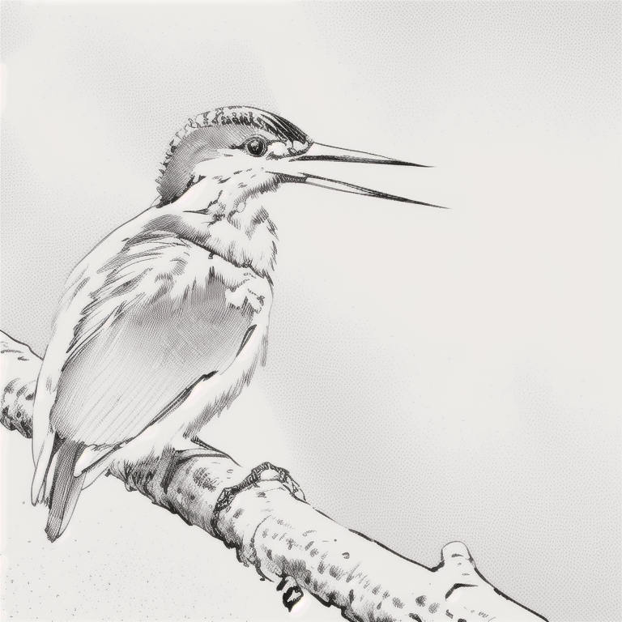
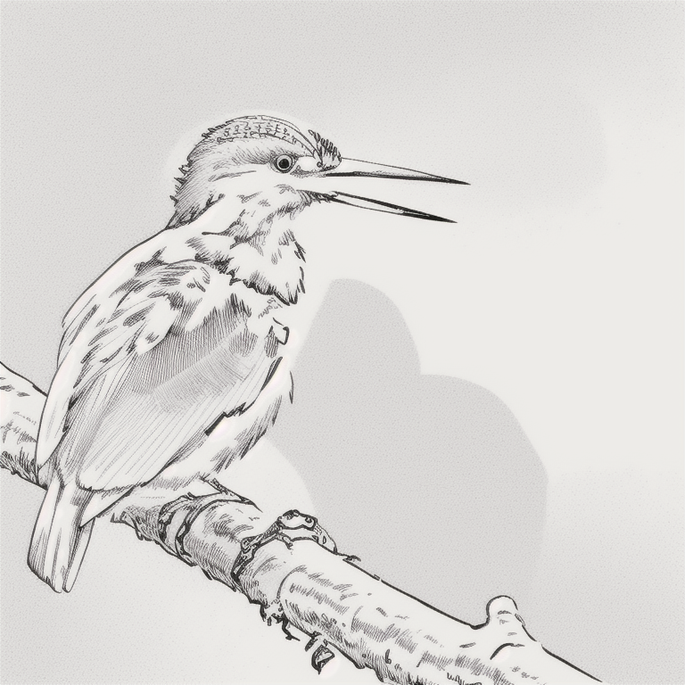
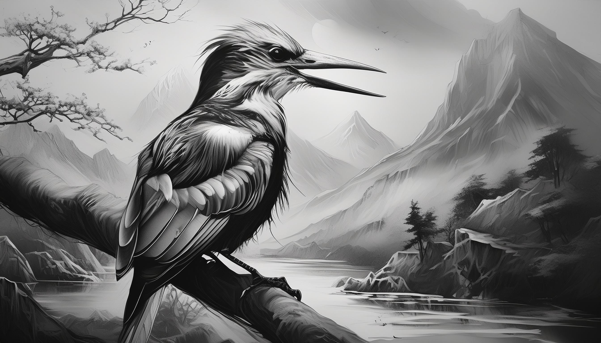

<a href="/">< Dizine dön</a> | <a href="/ornekler">< Örneklere dön</a>

# Fotoğraflarınızı çizime dönüştürün

Bu çalışmamızda bir önceki çalışmamızın tam tersini yani gerçek bir fotoğrafı çizime dönüştürceğiz. Burada yine bir kuş görseli kullanıldı ancak siz kişi fotoğrafları dahil başka bir çalışma kullanabilirsiniz. Bu noktada prompt alanında fotoğrafınızı iyi tasvir etmeniz gerekmekte.

# Stable Diffusion

Model olarak queratograySketch'i kullandık bu modele bu adresten https://civitai.com/models/80357 ulaşabilirsiniz.

İlk olarak controlnet alanımızda lineartı seçiyoruz ve yukardaki görselimizi yüklüyoruz.

Promptlarımız;

`a bird lineart, standing on a branch, black and white`

Negatif promptlarımız;
`photograph, painting`

Sonuçlarımızı bu şekilde oluştu;

# Firefly

Firefly (Mayıs 2024) itibariyle verdiğimiz bir görseli çizime dönüştürmekte zorlandı, firefly daha çok sanatsal sonuçlar üretti. Sonuçlarımızı ve ayarlarımızı paylaşıyoruz.

Sonuç;

