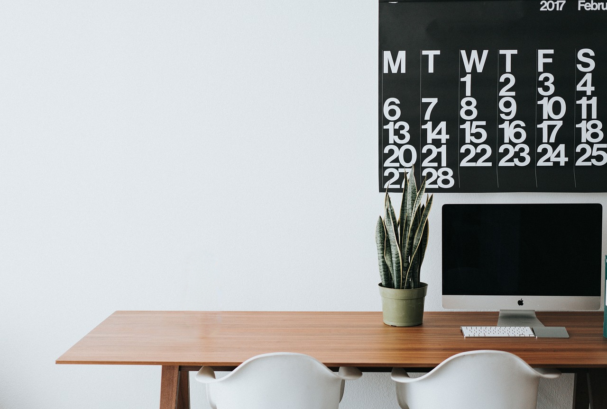

<a href="/">< Dizine dön</a> | <a href="/ornekler">< Örneklere dön</a>

# Yapay zeka ile fotoğraflar üzerinde düzenleme yapma

Bir önceki örneğimizde fotoğraftan istemediğimiz bir nesneyi kaldırmıştık. Bu örneğimizde ise var olan bir nesneyi başka bir nesne ile değiştireceğiz.

# Stable Diffusion ile fotoğrafta düzenleme yapma (A1111)

Görsel düzenlemelerimizde herhangi bir modeli kullanabiliriz ancak inpaint için özelleştirilmiş modeller kullanarak daha başarılı sonuçlar alabilirsiniz. 

Biz örneğimizde [Juggernaut XL Inpainting ](https://civitai.com/models/403361/juggernaut-xl-inpainting) modelini kullanacağız. 

İlk olarak A1111'i açarak txt2img sekmesine girerek alt bölümden inpainting düğmesine basıyoruz ve fotoğraf yükleme alanından üzerinde değişiklik yapmak istediğimiz görselimizi yüklüyoruz.

Aynı fotoğraf üzerinde düzenleme yapmak isterseniz [buradan](https://pixabay.com/photos/apple-computer-browser-business-2568755/) indirebilirsiniz.

İlk olarak görselimizdeki koku şişesini masamızdan kaldıracağız. Bunun için ilgi görseli fırçamızla seçiyoruz ve daha sonra prompt alanına 

`a cup of coffee` yazıyoruz.

Dilerseniz ilgili alana daha büyük seçerek diğer ışık ve yansıma alanlarını da dahil edebilirsiniz.

Varsayılan ayarlarda sadece Inpaint Area kısmını, "Only Masked" olarak değiştiriyor ve görselimizin ölçülerini almak için gönye ikonuna basıyoruz.

Generate düğmesine basarak görselimizi oluşturuyoruz

Görselinizde göre denoising ayarınızla oynayarak daha iyi sonuçlar elde edebilirsiniz. Biz bu sonucu elde ettik;

# Photoshop üzerine değişiklik

Benzer değişikliği yapmak ise Photoshop'ta nispeten daha kolay. Görselimizi lasso tool aracılığıyla seçtikten sonra generative fill alanına "remove object" promptunu yazarak Generate düğmesine bazıyoruz.

Sonucumuz bu şekilde oluştu.

