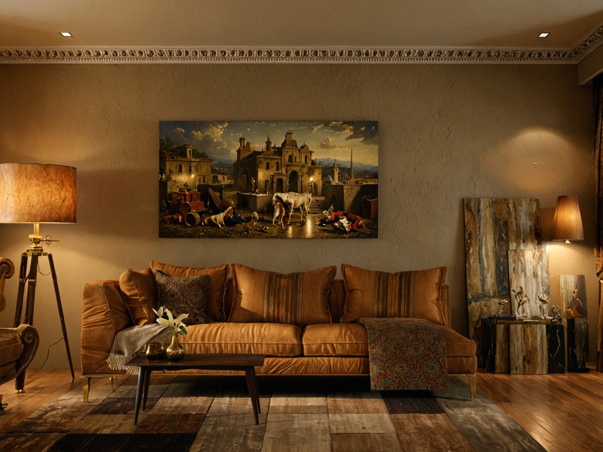
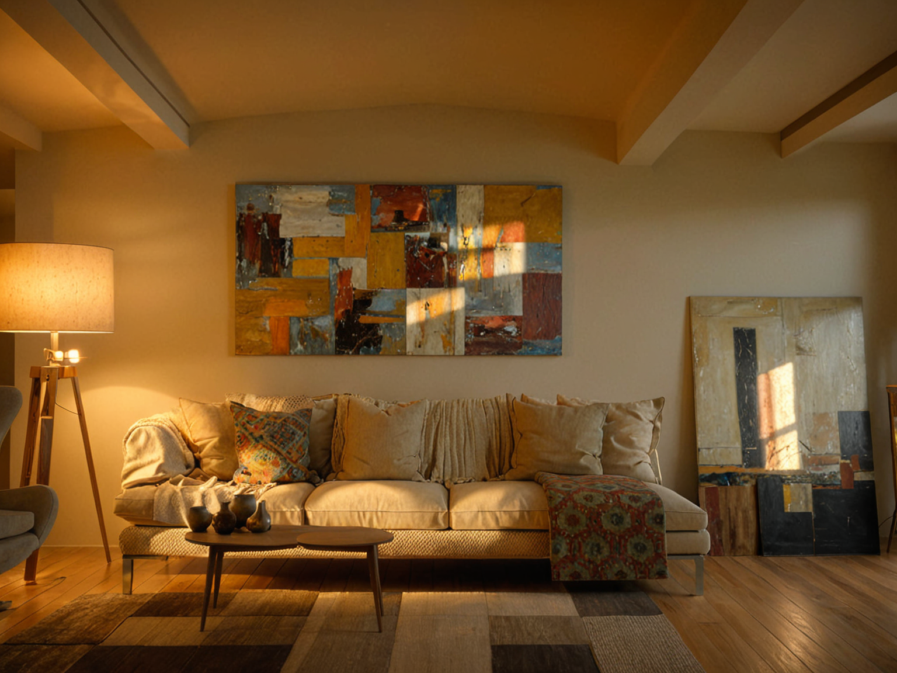
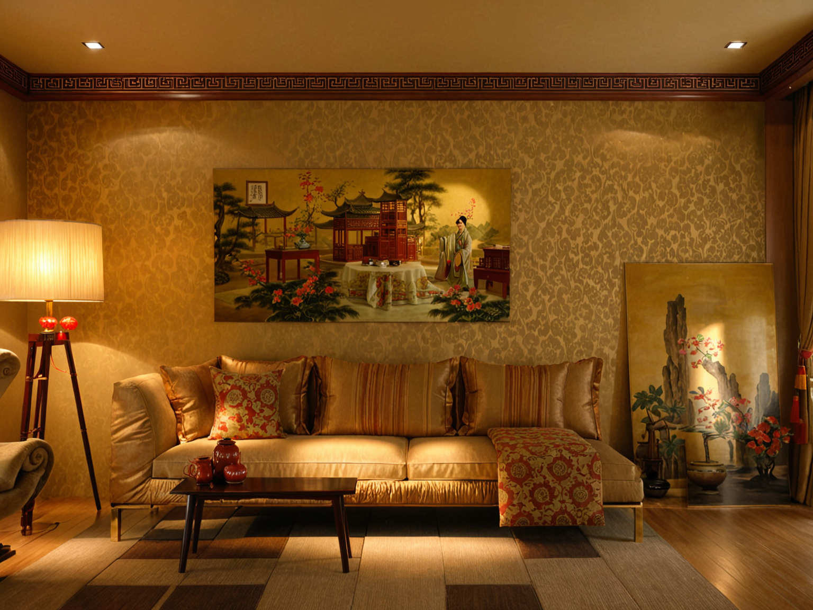
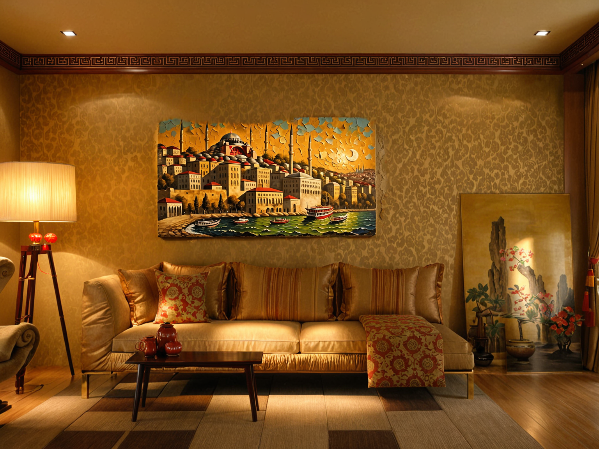

<a href="/">< Dizine dön</a> | <a href="/ornekler">< Örneklere dön</a>

# Yapay zeka ile iç mekan tasarımı

Bu örneğimizde varolan bir mekanı üretken yapay zeka ile yeniden tasarlayacağız. Örneğimizde A1111 kullanacağız ve RealVis modeli ile JJ's Living Room LoRa'sını kullanacağız.

Model indirme, controlnet ve LoRa kullanımı için sanat.ai üzerindeki dersler bölümümüze bakabilirsiniz.

İlk olarak referans olarak kullanacağımız oturma odası görselini seçiyoruz. 

Görselimizi Contrlnet fotoğraf alanında seçtikten sonra Canny modelini seçiyoruz. (lineart modeli de kullanılabilir)

Daha sonra prompt alanına 

`<lora:JJsLivingRoom_XL:1>, ((Living Room))  ((best quality)),((masterpiece)),((realistic)), soft light, modern living room, modern architecture, soft light`

Negatif prompt alanına ise 

`logo, text,word,cropped,low quality,normal quality,username,watermark,signature,blurry,soft,soft line,sketch,ugly,logo,pixelated,lowres, FastNegative`

yazıp diğer ayarları bu şekilde ayarlayarak görselimizi oluşturuyoruz.

Sonuçlarımız bu şekilde oldu.

Dilerseniz farklı stiller kazandırmak için promptlarınızı bu şekilde düzenleyebilirsiniz. (Chinese alanını başka tarzlarla değiştirebilirsiniz)

`<lora:JJsLivingRoom_XL:1>, ((Living Room)), chinese living room,  ((best quality)),((masterpiece)),((realistic)), soft light, soft light`

Son olarak, salondaki bellirli bir bölgeyi değiştirmek için oluşturulan görselimizi img2img - inpaint bölümüne alıp ilgili yeri değiştirdikten sonra promptları güncelleyebilirsiniz.

Sonuç görselimiz;

