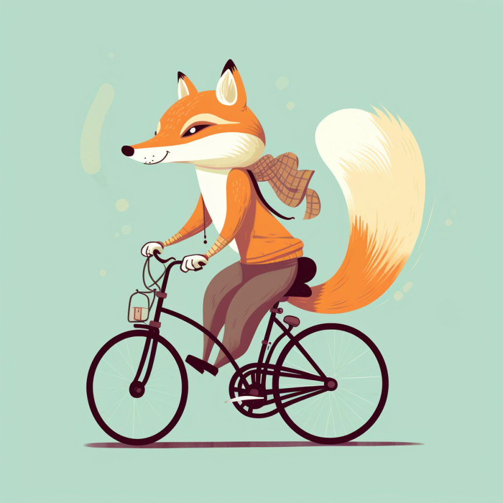
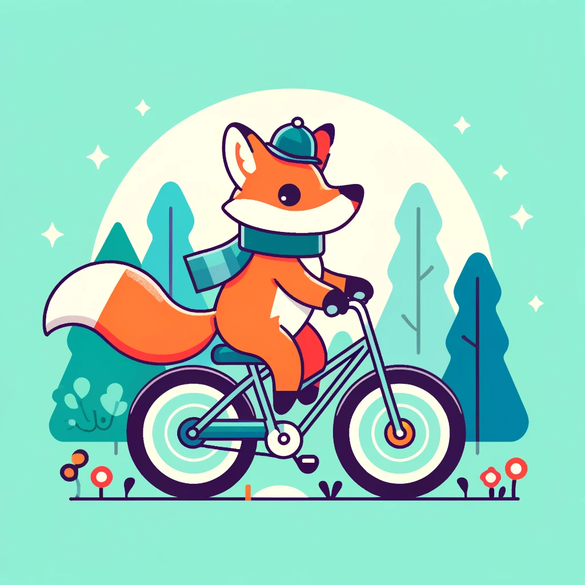
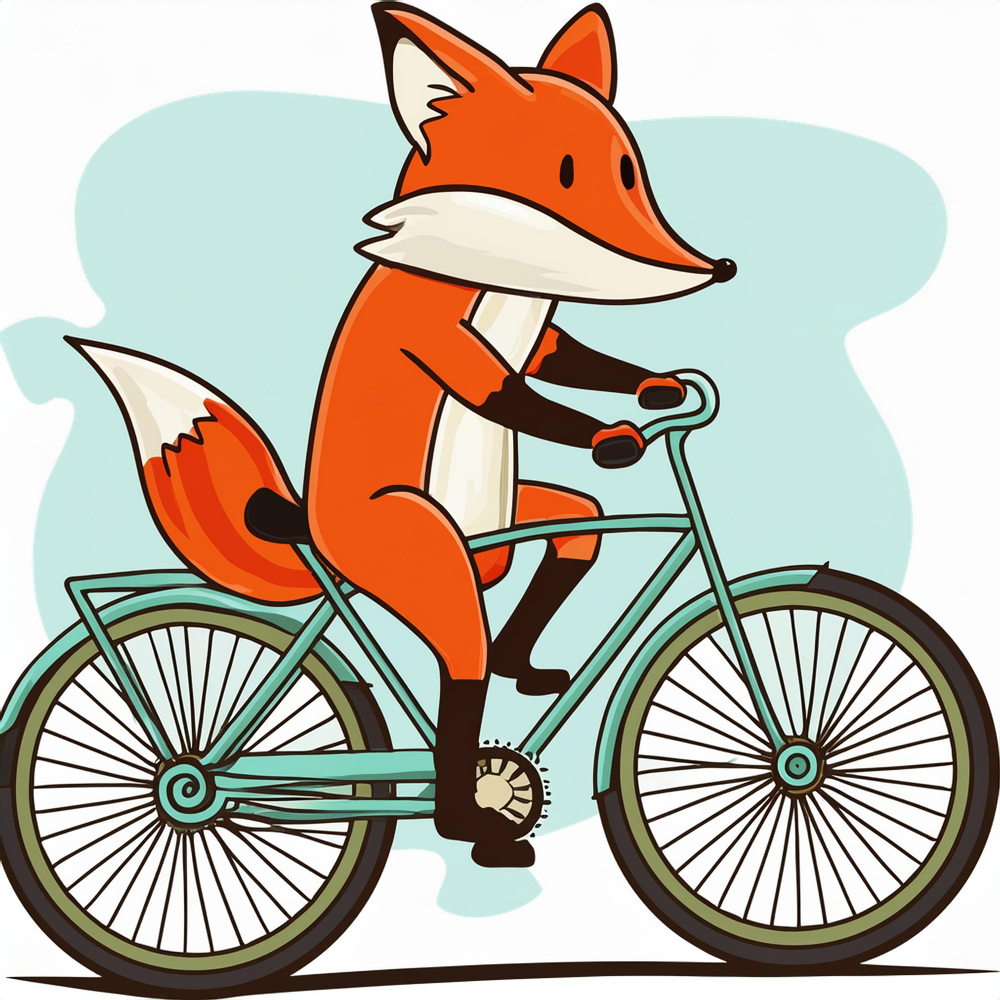

<a href="/">< Dizine dön</a> | <a href="/ornekler">< Örneklere dön</a>

# İlüstrasyon oluşturma

Tasarım alanında en çok kullanılan görsel tiplerinden biri de hiç şüphesiz ilüstrasyonlardır. Sunumlardan, web sitelerine, gazete ve dergilerden davetiyelere kadar bir çok alanda ilüstrasyonlara ihtiyaç duymaktayız. Bu dersimizde yapay zeka ile ilüstrasyon oluşturmayı [bir sonraki dersimizde](ilustrasyonu-vektore-donusturme.md) ise oluşturduğumuz ilüstrasyonları nasıl vektöre dönüştüreceğimizi göreceğiz.

# Midjourney üzerinde ilüstrasyon oluşturma

Midjourney üzerinde ilüstrasyon oluştururken görece daha iyi sonuçlar aldığımız 5.2 versiyonunu kullanacağız. Parametre olarak midjourney'e promptlarımızda bunu belirttiğimizi dikkat ediniz.

İlüstrasyonumuz basitçe bisiklet süren bir tilki olsun.

`vector art of a fox riding a bike --v 5.2 --s 0`

# Dall-e ile ilüstrasyon oluşturma

Dall-e ile ilüstrasyon için Türkçe olarak bu promptu girdik 'illustration a fox riding a bike, vector style'  ChatGpt4 bizim için bu komutu oluşturdu.

`A vector illustration of a fox riding a bicycle through a forest. The fox is stylized with clean lines and vibrant colors, wearing a small hat and a scarf. The bicycle is simple and modern, and the forest background includes minimalist trees and flowers. The overall style is playful and cartoon-like, with a cheerful atmosphere.`

# Adobe firefly ile ilüststrayon oluşturma

Adobe firely'da Türkçe olarak girdiğimiz aşağıdaki promptumuzla ilüstrasyonumuzu kolaylıkla oluşturabildik.

`bisiklet süren bir tilki ilüstrasyonu`

# Stable Diffusion

Stable Diffusion (A1111) kullanarak RevAnimated modeli ile paylaştığımız promptlarla görselimizi oluşturabildik (Euler a sampling metodu kullanıldı)

`vector illustration of a fox riding a bicycle`

Negatif Promptlarımız;

`painting, drawing, photograph`

