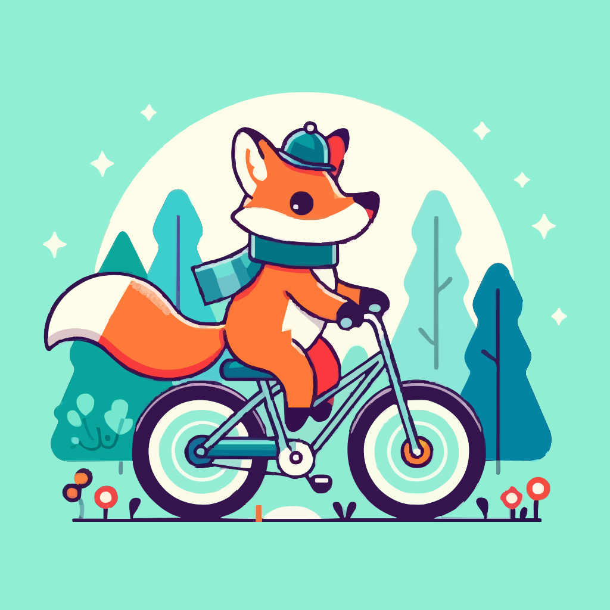

<a href="/">< Dizine dön</a> | <a href="/ornekler">< Örneklere dön</a>

# İlüstrasyonu vektöre dönüştürme

Her ne kadar içinde yapay zeka kullanılmasada yapay zeka ile oluşturduğumuz görselleri vektör formatında kullanmak çok ihtiyaç duyabileceğimiz bir yöntem. Bu örneğimizde ücretsiz olarak kullanabileceğimiz açık kaynak bir proje olan Vtracer kullanarak bir önceki dersimizde oluşturduğumuz ilüstrasyonu vektöre dönüştüreceğiz.

İlk olarak https://www.visioncortex.org/vtracer/ adresine giriyoruz ve büyük mavi alana görselimizi sürükleyip bırakıyoruz.

Görselimiz saniyeler içinde "SVG" formatına dönüştürülüyor. Sağdaki ayarlar kısmından istediğiniz değişiklikleri yaparak daha keskin konuçlar alabilirsiniz. En sağ yukardaki "Download AS SVG" düğmesiyle bilgisayarınıza indirebilirsiniz.

Vektöre dönüştürülmüş görselimizi [buradan indirebilirsiniz](../gorseller/vektore-donusturme-sonuc-1.svg).

