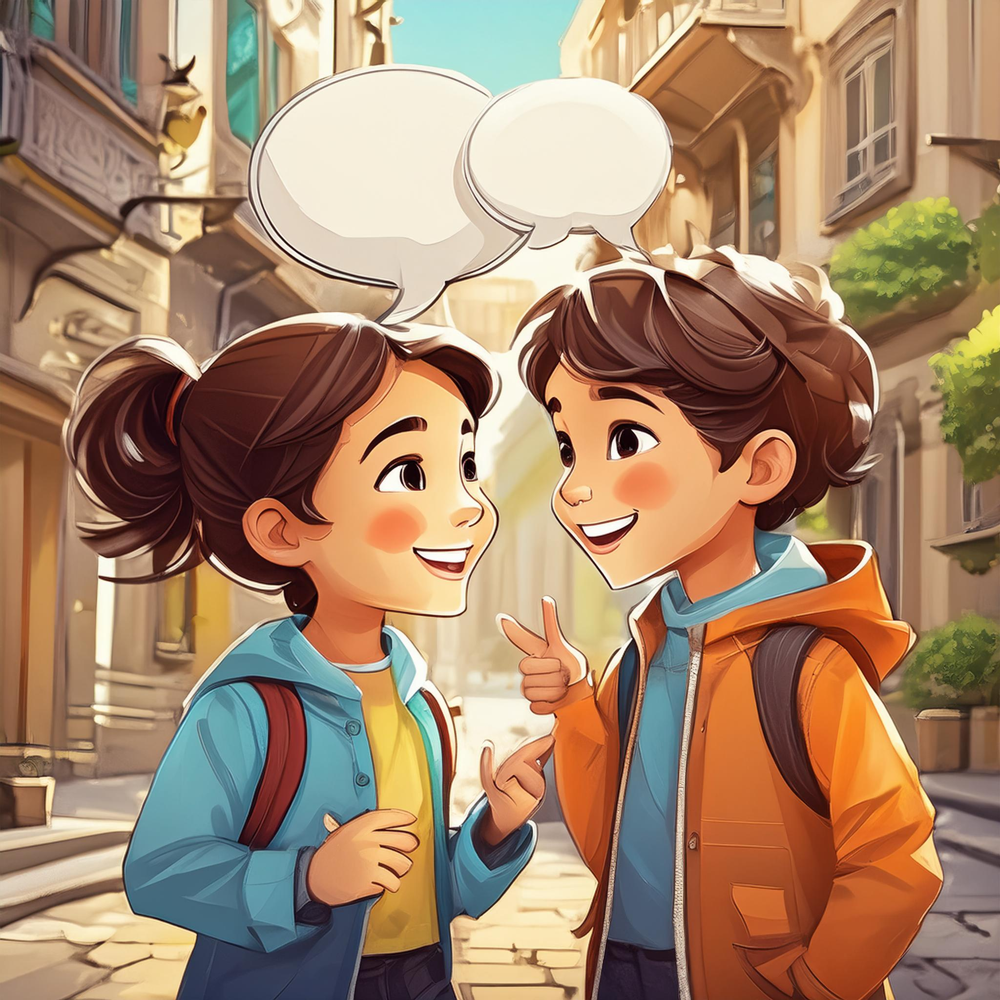

<a href="/">< Dizine dön</a> | <a href="/ornekler">< Örneklere dön</a>

# Yapay zeka ile karikatür hazırlama

Yapay zekanın en verimli kullanılabileceği alanlardan birisi de karikatür çizme alanı. Esprinizi ve çizim öğelerinizi yapay zekaya iyice anlattıktan sonra konuşma balonları ile size harika çizimler sunabiliyor. Konuşma balonlarındaki metinler konusunda şu an için (Haziran 2024) hatalar yapsa da bir yıl içinde burdada sorunsuz olacağını düşünüyoruz. Sözlerimizi daha fazla uzatmadan hemen ilk karikatürlerimizi çizmeye başlayalım. Örneklerimizde Midjourney, Firefly ve Dall-e kullanacağız.

# Midjourney

Midjoruney'de karikatürümüzü içi boş balonlar şeklinde promptlarımızla tarif ediyoruz. Espriden çok sahneye odaklandık;

`a caricature , two child speaks each other, empty the talking bubbles`

Sonuçlarımız;

`a caricature , a fox and a bear speaks each other with the two talking bubbles `

# Dall-e

Dall-e kullanırkan direkt Türkçe olarak promptlarımızı verebiliyoruz. ChatGPT-4 kullanarak bu komutu verdik, 

`birbiriyle konuşan iki çocuk karikatürü yapmanı istiyorum, üzerinde konuşma balonları olsun`

Dönüştürülen komut

`A cartoon of two children having a conversation. The scene is lively and colorful, showing a friendly interaction between the kids. Both children are standing, with one on the left and the other on the right, each with a speech bubble above their heads. The background is simple, perhaps with a playground or park setting. The children should be expressive, with one child possibly smiling and the other listening intently. Include clear and readable speech bubbles, but leave them empty for custom text.`

# Firefly

Firefly'da yine karikatür konusunda oldukça başarılı sonuçlar çıkarabiliyor. Dall-E'deki promptumuza "İçerik Türü" olarak 'resim' ve "Efekt" olarak 'dijital resim'i seçerek aşağıdaki karikatürü yapabildik;

Promptumuz;

`birbiriyle konuşan iki çocuk karikatürü yapmanı istiyorum, üzerinde konuşma balonları olsun`

