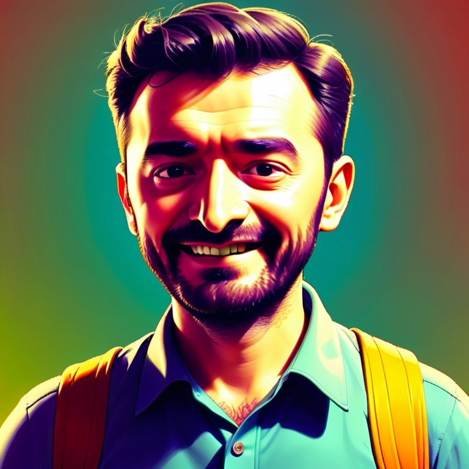

<a href="/">< Dizine dön</a> | <a href="/ornekler">< Örneklere dön</a>

# Fotoğraflarınızı karikatürize edin

Yapay zeka ile kendinizin ya da başka birinin fotoğrafını karikatürize etmek isterseniz bu dersimiz size göre. Daha önce LoRa ile bu çalışmaları yapabilirken artık IpAdapter aracılığıyla fotoğrafları karikatürize edebiliyoruz. 
Örneğimiz boyunca A1111 kullanıyor olacağız ama dilerseniz ComfyUI ile de benzer bir çalışmayı kendiniz yapabilirsiniz.
Gelelim nasıl yapabileceğinize;

İlk olarak A1111 modellerimiz arasından IpAdapter FaceId modellerinden Portrait'in yüklü olduğundan emin olalım https://huggingface.co/h94/IP-Adapter-FaceID/resolve/main/ip-adapter-faceid-portrait_sdxl.bin?download=true
İlgili dosyayı extensions/sd-webui-controlnet/models klasörüne yüklemeniz gerekmekte. Controlnet kurulumu ve model indirme konusunda yardım almak için sanat.ai adresindeki derslerimize bakabilirsiniz.

Model olarak ProtoVision XL kullandık ama dilerseniz başka bir XL modelini de kullanabilirsiniz https://civitai.com/models/125703/protovision-xl-high-fidelity-3d-photorealism-anime-hyperrealism-no-refiner-needed

İlk olarak hemen controlnet alanına gelerek Preprocessor olarak 'ip adapter auto' yu model olarak 'IP Adapter Faceid Portrait XL'i seçip gerekli görselimizi yüklüyoruz. 
Ekran görüntüsü bu şekilde.

Daha sonra prompt alanına gerek basitçe promptlarımızı giriyoruz.

`comic cartoon,drawing`

Her şey hazır, şimdi generate düğmesine basarak karikatürlerimizi oluşturuyoruz, sonuçlarımız böyle oluştu;

