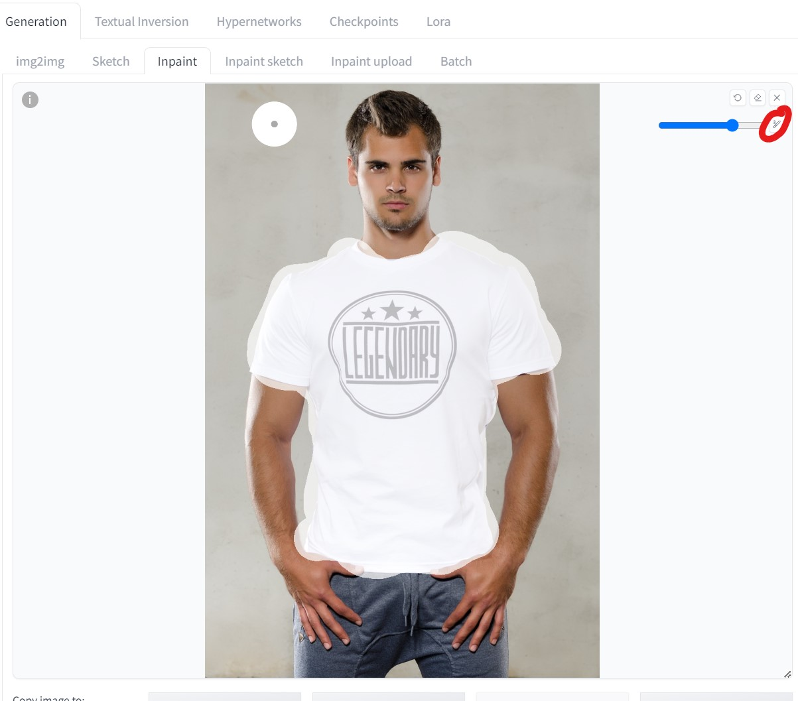
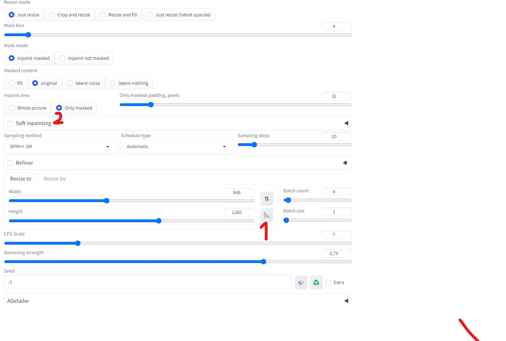
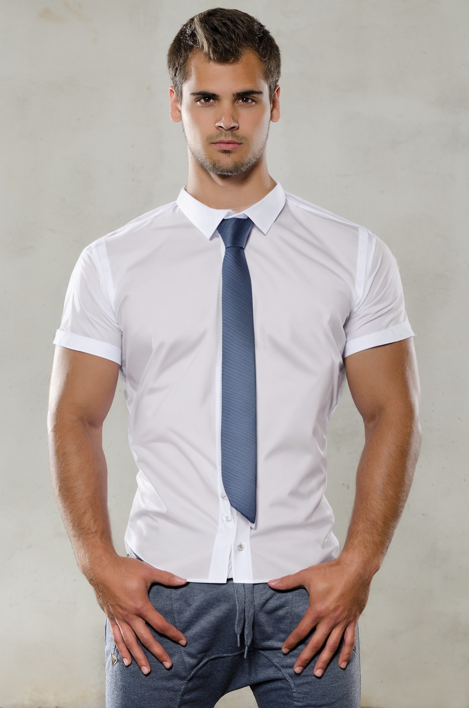
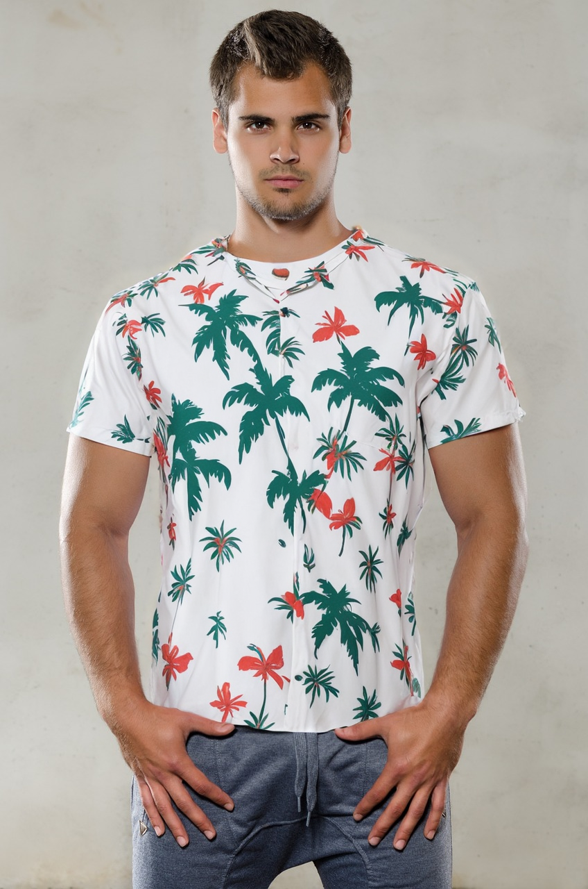
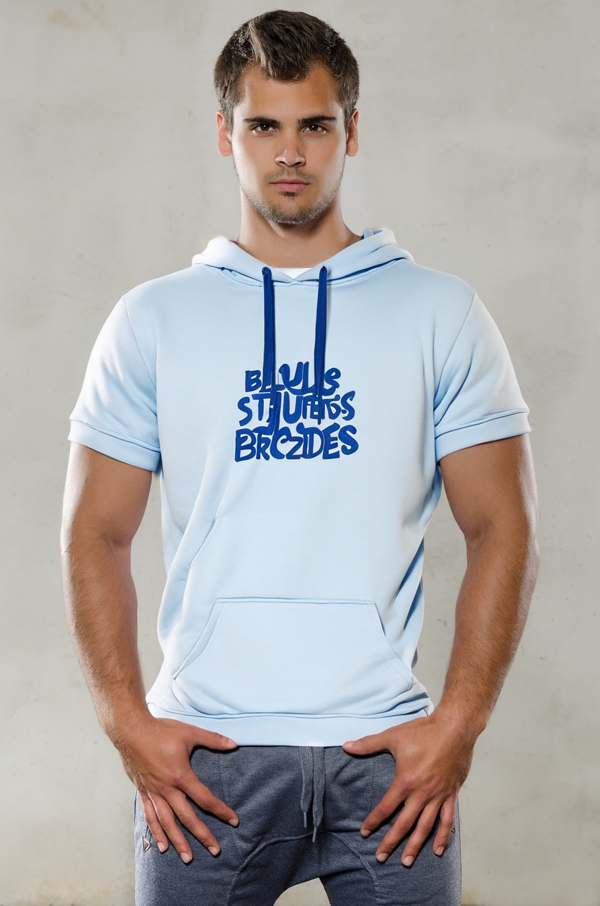

<a href="/">< Dizine dön</a> | <a href="/ornekler">< Örneklere dön</a>

# Yapay Zeka ile Kıyafet Değiştirme

Bu örneğimizde mevcut bir fotoğraf üzerindeki kişinin kıyafetini yapay zeka aracılığıyla değiştireceğiz. 
Örneğimizde Stable Diffusion (A1111) kullandık. A1111 ve ilgili araçların kurulumu için kitabımızın kurulumlar bölümüne bakabilirsiniz.

Değişikliklerimiz için ilk olarak epicRealism Inpainting modelini indirmemiz gerekiyor, [bu adresten](https://civitai.com/models/25694?modelVersionId=134361) indirebilirsiniz.

İlk olarak A1111 açtıktan sonra sırasıyla img2img bölümüne giriyoruz ve ordaki altta düğmelerden inpainting'e basıyoruz.

Düzenleme yapmak için pixabay sitesinden [bu modeli](https://pixabay.com/photos/title-photo-logo-shirt-man-1587325/) tercih ettik, siz de herhangi bir görseli tercih edebilirsiniz.

Şimdi fotoğrafımızı yükleme alanına bırakıyoruz ve fırça aracılığıyla değişiklik yapacağımız bölümün üstünden geçiyoruz.

Şimdi ekrandaki sırayla belirttiğim düğmelere basarak şu işlemleri yapıyoruz.

1) Fotoğrafın çözünürlüğünü otomaik olarak yükseklik ve genişlik alanına yansıt.

2) Sadece seçtiğim alanda değişiklik yap!

Son olarak promptumuzda hangi kıyafeti görmek istiyorsak onu giriyoruz.

`shirt and tie`

`hawai shirt`

`blue hoodies`

Sonuçlarımız;

