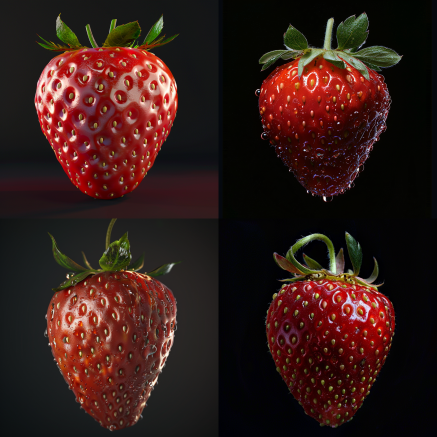
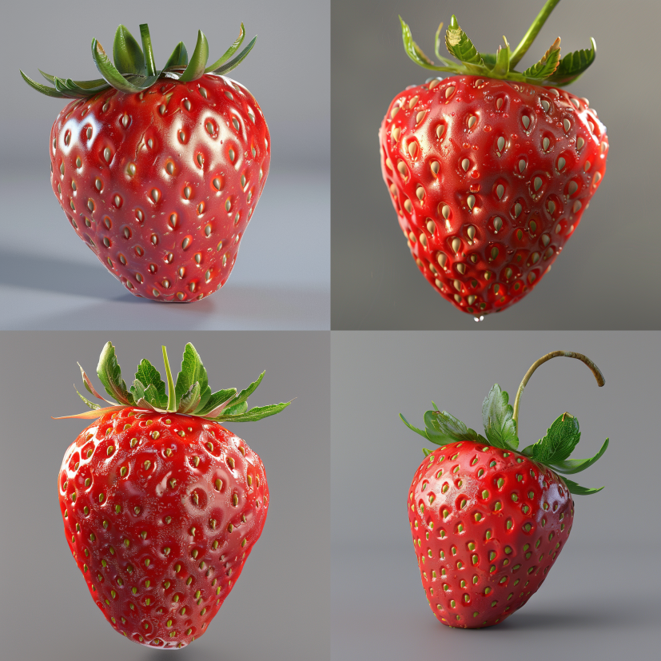

<a href="/">< Dizine dön</a> | <a href="/ornekler">< Örneklere dön</a>

# Kombinasyonla fotoğraf oluşturma

Yapay zeka ile görsel oluşturken sıkça promptlarımızın kombinasyonunu yaparak farklı kelimelerle alacağımız sonuçları görmek istiyoruz. Kombinasyon yapmadan bunları teker teker girerek sonuç beklemek hem yorucu hem de ciddi zaman kaybına neden olabilir. Örneğimizde farklı platformlarda (Midjourney, A1111 ve ComfyUI) nasıl kombinasyon yapabileceğimizi göreceğiz.

# Midjourney

Midjourney'de prompt kombinasyonu yapmak gerçekten çok kolay {kelime1,kelime2} şeklinde hemen kombinasyon yapabilmektesiniz.

`macro photo of a {ladybird,strawberry},photo realistic,high details,8k,best quality, black background`

Örneğinde midjourney bize hem uğur böceği hem de çilek için 4'er sonuç gösterecektir. Eğer arka planı da farklı kombinasyonlar görmek isterseni bu şekilde promptunuzu geliştirebilirsiniz. 

`macro photo of a {ladybird,strawberry},photo realistic,high details,8k,best quality, {black,grey} background`

Midjourney bize sırayla;
ladybird ve black background
ladybird ve grey background
strawberry ve black background
strawberry ve gray background

örnekleri oluşturacaktır.

Sonuçlarımızdan bazıları;

# Stable Diffusion (A1111)

A1111'de kombinasyon yapmak için promptumuzu yazdıktan sonra en alt bölümdeki Script alanına gidiyoruz ve XYZ Plot'ı seçerek "X type" alanına "Prompt S/R" girerek  promptumuzda geçen değiştirmek istediğimiz ifadeyi en başa yazarak virgülle geğiştirmek istediğimiz kelimeleri yazıyoruz.

`macro photo of a ant, photo realistic, high details, 8k, best qualit, black background`

Sonuçlarımızdan bazıları;

A1111'de de Midjourney örneğinde olduğu gibi arka plan rengimizi de değiştirmek istersek bu sefer "X type'a" ek olarak "Y type" alanına yine "Prompt S/R" girip bu sefer "black, grey" yazıyoruz.

# ComfyUI 
