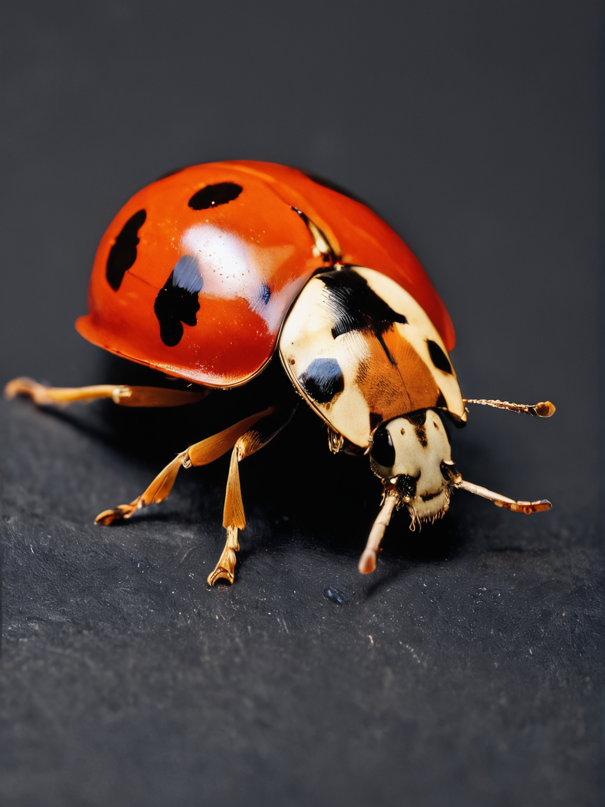

<a href="/">< Dizine dön</a> | <a href="/ornekler">< Örneklere dön</a>

# Marko çekim fotoğraflar oluşturma

Yapay zekanın en iyi simüle ettiği fotoğrafçılık tarzlarından biri makro çekimler. Bu örneklerimizde çeşitli canlı ve nesneler için makro çekim fotoğrafları oluşturacağız. Farklı platformların bu konuda yeteneklerini görebilmeniz için Stable Diffusion, Midjourney ve Firefly üzerinde örneklerimizi yapacağız.

# Stable Diffusion

Örneklerimiz için Wildcard Fusion modelini kullandık. https://civitai.com/models/267728/wildcardx-xl-fusion

Fotoğraflarımızı meta bilgileri ile paylaşıyoruz, dilerseniz A1111 üzerinde "PNG Info" aracılığıyla promptların yanında diğer bilgileri de alabilirsiniz.

Promptlarımız;

`macro photo of a ladybird,photo realistic,high details,8k,best quality,black background`

Negatif promptlarımız;

`drawing,low resolution,blurry`

Sonuçlarımız

`macro photo of a bee,photo realistic,high details,8k,best quality,black background`

`macro photo of a ant,photo realistic,high details,8k,best quality,black background`

# Midjourney

`macro photo of a ant,photo realistic,high details,8k,best quality,black background`

# Firefly

`macro photo of a ant,photo realistic,high details,8k,best quality,black background`

