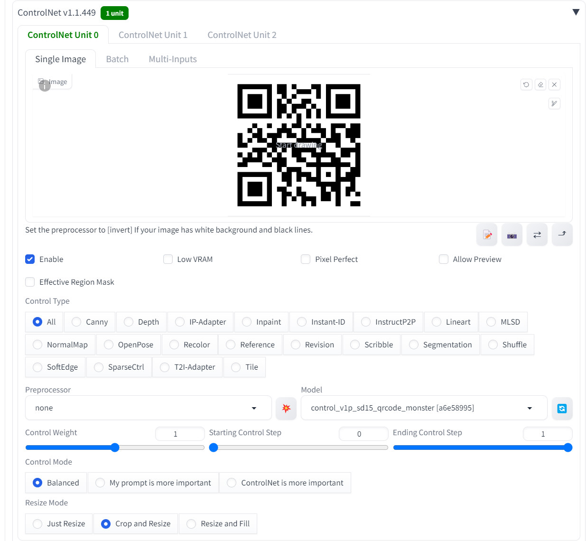
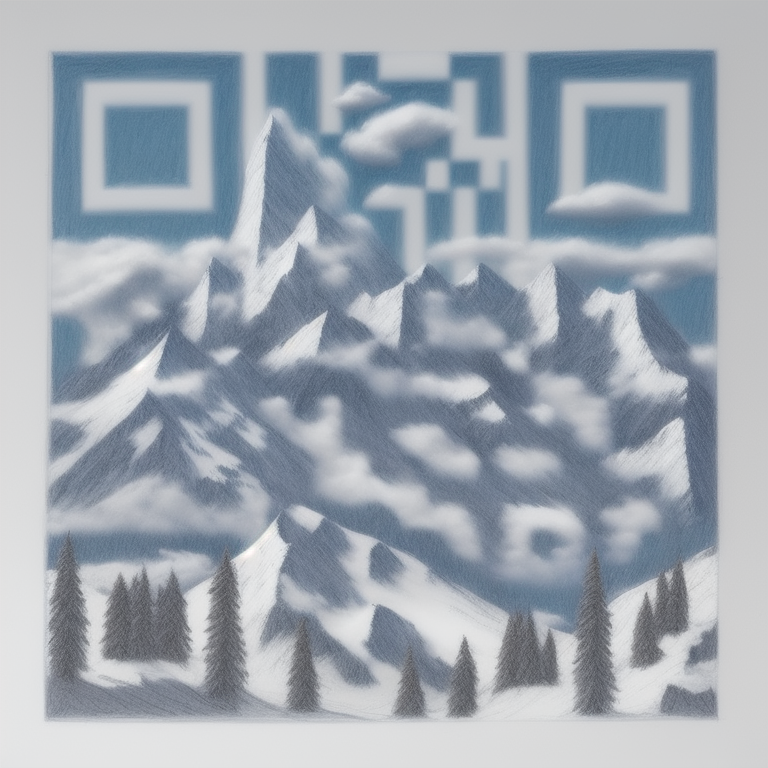

<a href="/">< Dizine dön</a> | <a href="/ornekler">< Örneklere dön</a>

# QR kodu ile görsel oluşturma

[Bir önceki dersimizde](desen-kullanarak-fotograf-olusturma.md) desen kullanarak görsel üretmiştik. Bu dersimizde ise bir QR kodu kullarak görsel üreteceğiz.

İlk olarak A1111 üzerinden Controlnet'in kurulu olması gerekiyor. Controlnet kurulumu için sanat.ai adresindeki derslerimizi bakabilirsiniz.

Desenleri görsellerimize uygulamak için QRCodeMonster isimli controlnet modelini kullanacağız. Bu modeli bu adresten indirebilirsiniz https://huggingface.co/monster-labs/control_v1p_sd15_qrcode_monster/blob/main/control_v1p_sd15_qrcode_monster.safetensors

Modelimizi "extensions\sd-webui-controlnet\models" dizinine kaydediyoruz.

QR kodumuz hazırda ise hemen controlnet alanına yükleyerek görselimizi oluşturmaya başlayabiliriz ancak hazır değilse internetteki online qr oluşturma sitelerini kullanarak QR kodunuzu üretebilirsiniz. 
Biz A1111 üzerindeki QR Code Generator eklentisiyle sanat.ai içi bu QR kodunu oluşturduk. 

İlk olarak QR kodumuzu controlnet alanına yerleştiriyoruz ve görseldeki gibi ayarlıyoruz. Preoprocessor girmediğimize dikkat ediniz.

Prompt olarak bir pizzadan QR kodu oluşturmak istediğimiz için promptlarımızı giriyoruz. Bu arada Stable Diffusion 1.5 için hazrılanmış bir controlnet modeli kullandığımız için RevAnimated modelini kullandık. Siz de 1.5 sürümünü baz alan herhangi bir checkpoint kullanabilirsiniz. Sampling metodu olarak da "euler a" kullandık.

`pizza drawing`

Başka bir prompt ile oluşturduğumuz başka bir sonuç;

`mountain drawing, clouds, snow`

