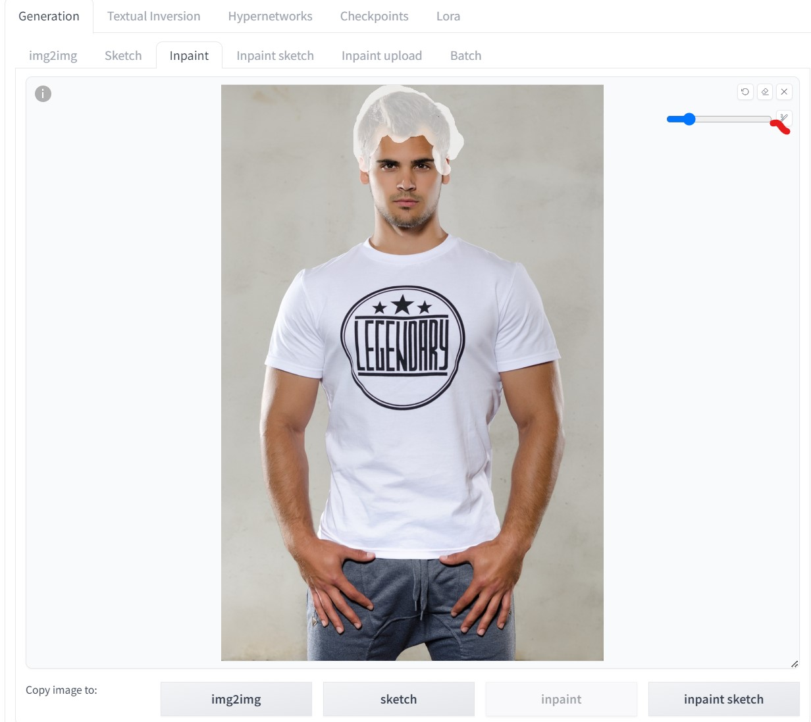
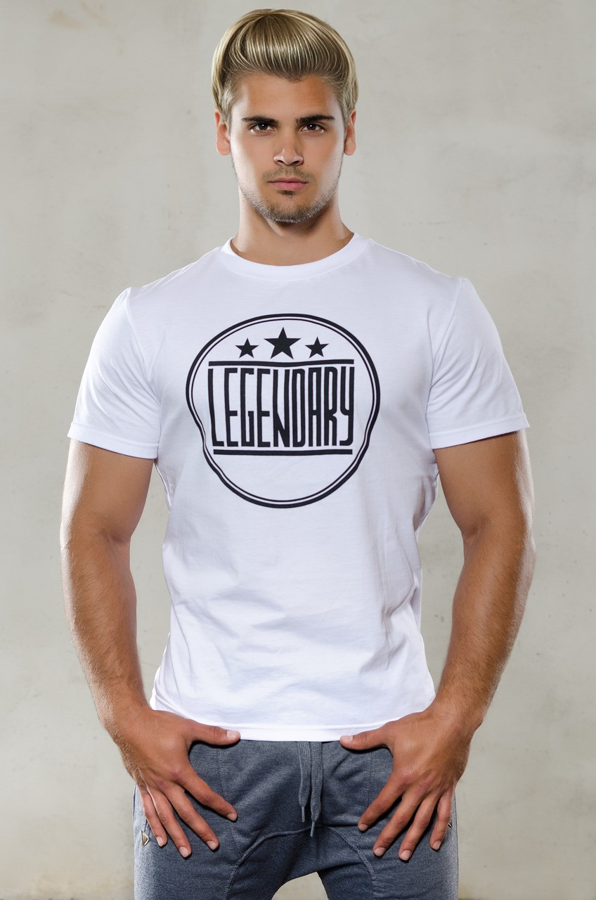
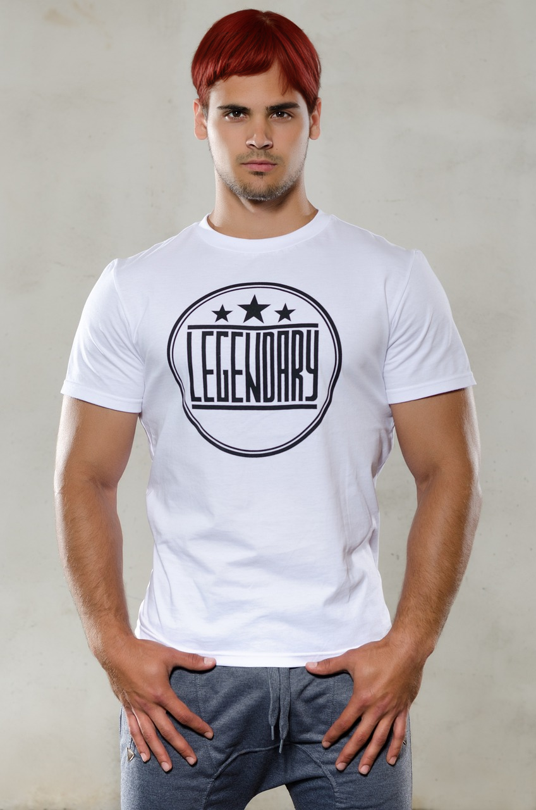

<a href="/">< Dizine dön</a> | <a href="/ornekler">< Örneklere dön</a>

# Saç stili değiştirme

Bu örneğimizde bir önceki [kıyafet değiştirme](kiyafet-degistirme.md) örneğimizdeki ile nerdeyse aynı şeyi yapacağız ve yapay zeka yardımıyla modelimizin saç stilini değiştireceğiz.
Örneğimizde Stable Diffusion (A1111) kullandık. A1111 ve ilgili araçların kurulumu için kitabımızın kurulumlar bölümüne bakabilirsiniz.

Değişikliklerimiz için ilk olarak epicRealism Inpainting modelini indirmemiz gerekiyor, [bu adresten](https://civitai.com/models/25694?modelVersionId=134361) indirebilirsiniz.

İlk olarak A1111 açtıktan sonra sırasıyla img2img bölümüne giriyoruz ve ordaki altta düğmelerden inpainting'e basıyoruz.

Düzenleme yapmak için pixabay sitesinden [bu modeli](https://pixabay.com/photos/title-photo-logo-shirt-man-1587325/) tercih ettik, siz de herhangi bir görseli tercih edebilirsiniz.

Şimdi fotoğrafımızı yükleme alanına bırakıyoruz ve fırça aracılığıyla değişiklik yapacağımız bölümün üstünden geçiyoruz.

Şimdi ekrandaki sırayla belirttiğim düğmelere basarak şu işlemleri yapıyoruz.

1) Fotoğrafın çözünürlüğünü otomaik olarak yükseklik ve genişlik alanına yansıt.

2) Sadece seçtiğim alanda değişiklik yap!

[alt text](../gorseller/kiyafet-3.jpg)

Son olarak promptumuzda hangi kıyafeti görmek istiyorsak onu giriyoruz. Denoising değerini düşürerek fotoğrafınızdaki renk tonlarına yakın sonuçlar elde edebilirsiniz.

`blonde hair`

`black curly hairs` 

`long red hair` 

Sonuçlarımız;

