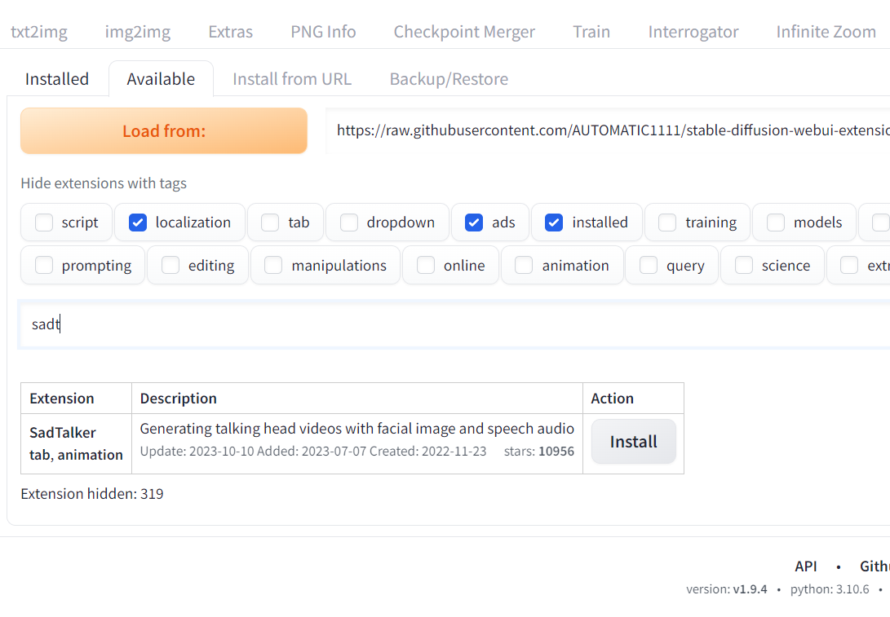

<a href="/">< Dizine dön</a> | <a href="/ornekler">< Örneklere dön</a>

# Sadtalker ile fotoğrafları konuşturma

Yapay zekayla herhangi bir fotoğrafı verdiğiniz ses dosyasıyla konuşturmak ister misiniz? İşte tam size göre bir eklenti. Bu dersimizde SadTalker eklentisi ile fotoğrafları konuşturacağız.

İlk olarak Extensions bölümüne ve ardından Available alt sekmesine giriyoruz ve "Load from" düğmesine basarak eklentilerimizi listeyliyoruz. Daha sonra arama alanına "sadtalker" yazarak görseldeki eklentiyi "Install" diyerek kuruyoruz. En son olarak tekrar Installed alt sekmesine geçerek "Apply and RestartUI" düğmesi ile A1111'i tekrar başlatıyoruz.

