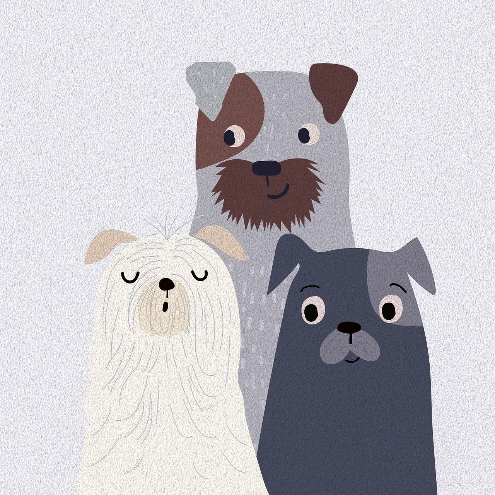
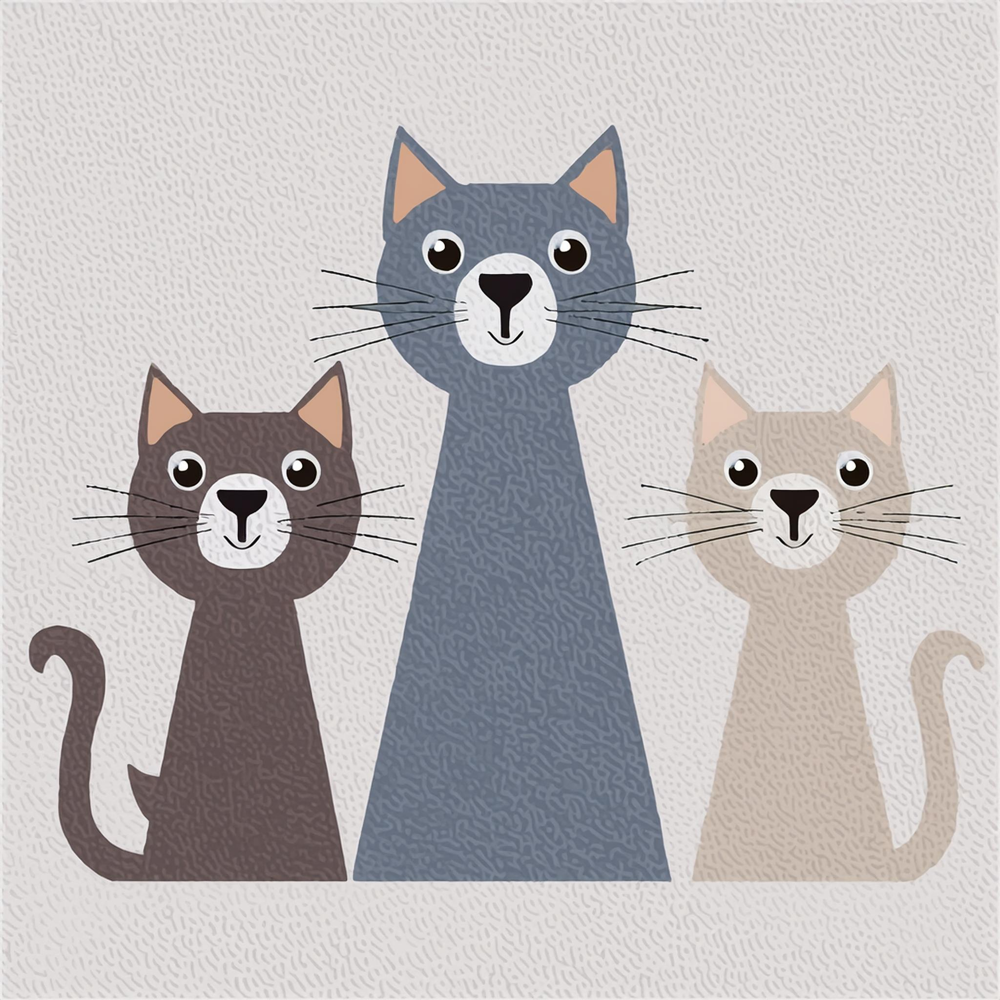
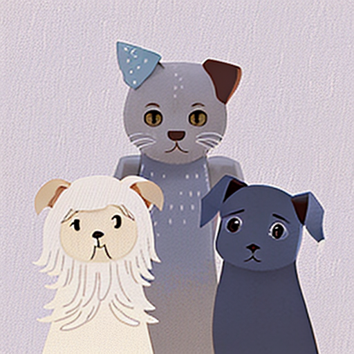

<a href="/">< Dizine dön</a> | <a href="/ornekler">< Örneklere dön</a>

# Stil Transferi

Yapay zekanın bizlere getirdiği en büyük imkanlardan biri de hiç şüphesiz bir fotoğraftaki stil ve tarzın başka bir fotoğrafa aktarılması. Artık hemen hemen bütün araçlarda bu özelliği kullanmak mümkün. Bu yazımızda Midjourney, Firefly ve StableDiffusion'da nasıl bir fotoğrafın stilini aktarabileceğinizi anlatacağız.

Bütün platformlarda stini aktarmak için bu çalışmayı kullanacağız. 

Kaynak: https://pixabay.com/illustrations/poster-drawing-nature-animals-dogs-8571685/

## Midjourney

İlk olarak detayları atmamak adına görselimizi Midjourney'e vererek hangi promptlarla bu görseli oluşturabileceğimiz tahmin etmesini istiyoruz.

Görselimizin promptlarını alıp kedi örneği ile değiştirdikten sonra /imagine promptu ile giriyoruz ve --sref parametresiyle daha önce yüklediğimiz görselimizin url adresini veriyoruz.

/imagine three cat drawing,white background, textured paperlike texture, simple shapes, cute and cheerful style, using vector graphics --sref https://s.mj.run/bwLVlhgosHc

Görselimiz oluşturuldu

## Firefly

İlk olarak stiller bölümüne giderek "görüntü yükle" dümesiyle referans görselimizi yüklüyoruz.

Daha sonra metin alanına 

three cat drawing,white background, textured paperlike texture, simple shapes, cute and cheerful style, using vector graphics

promptunu giriyoruz ve oluştur düğmesine basıyoruz. Görselimiz oluşturuluyor.

## Stable Diffusion

Prompt alanına aynı promptlarımızı giriyoruz. (Rev animated kullandık)

Controlnet kurulumu ve model indirme için bu yazıya bakabilirsiniz. https://sanat.ai/dersler/controlnet-kurulumu-ve-modelleri-indirme
Ip-adapter modelini indirmek için ise bu linki takip edebilirsiniz. https://huggingface.co/h94/IP-Adapter/tree/main/models

Daha sonra controlnet alanına giderek Ip-Adapter'i seçiyoruz ve fotoğraf yükleme alanından kaynak fotoğrafımızı (yukardaki) girerek model bölümünden ip-adapter-plus_sd15'i seçiyoruz

Generate düğmesine baarak görselimizi oluşturuyoruz.

