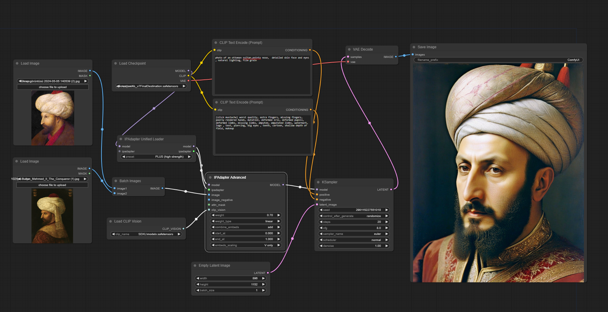
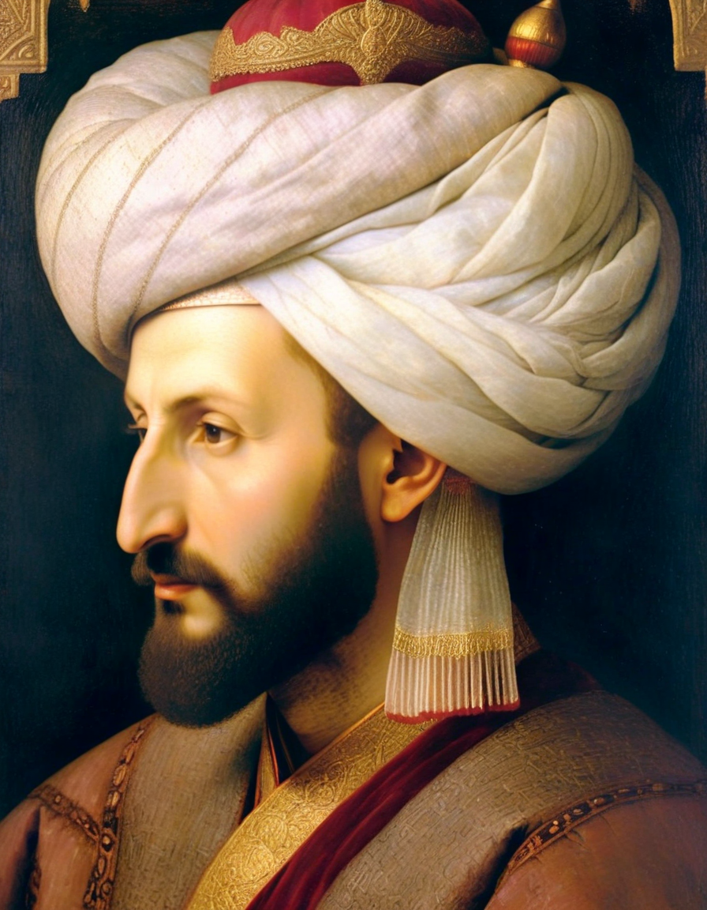
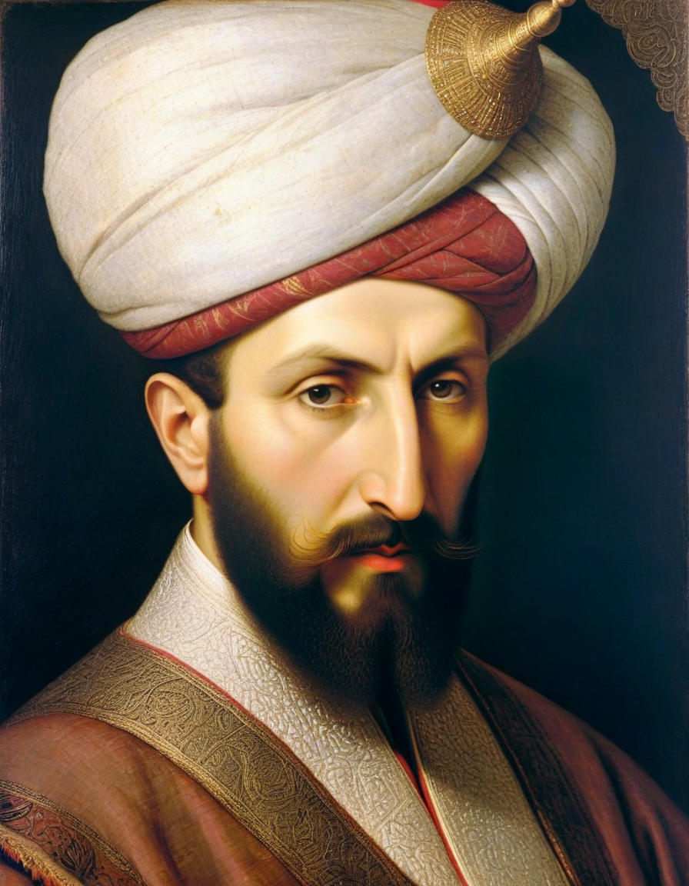
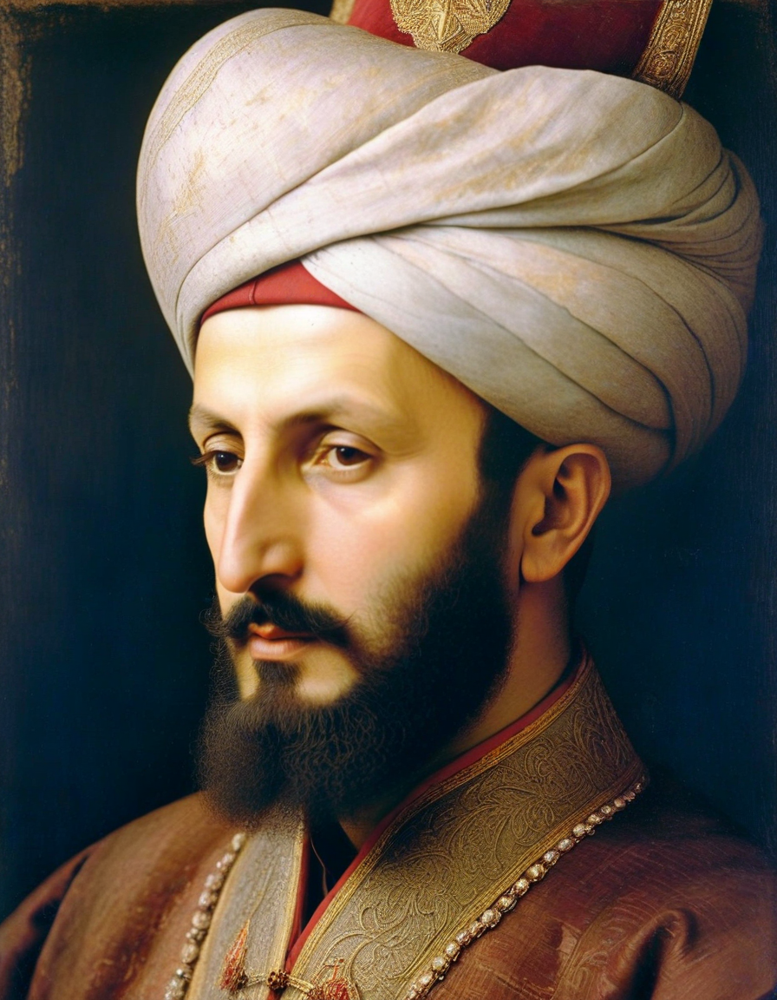
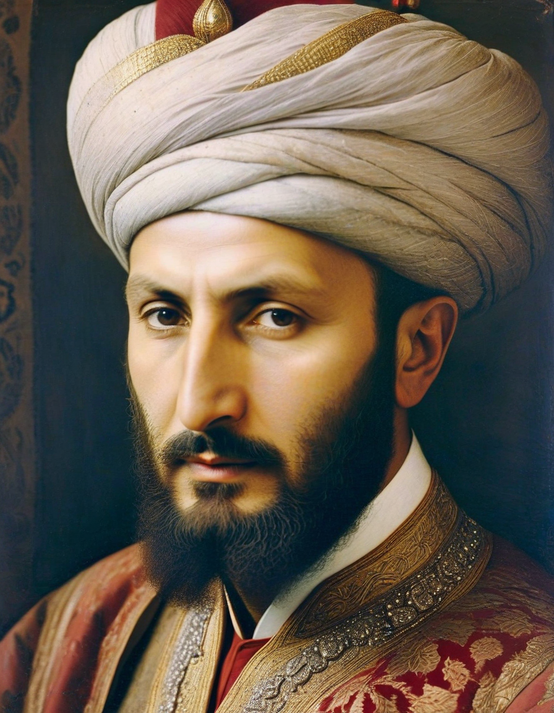

<a href="/">< Dizine dön</a> | <a href="/ornekler">< Örneklere dön</a>

# Tarihi karakterleri canlandırma

Tarihi karakterler bugün yaşasalardı nasıl görünürlerdi merak eder misiniz hiç? Yapay zekanın bizlere sunduğu hizmetlerden biri de elimize ulaşmış portre ve çizimlerinden onların fotoğraflarını oluşturabilmemiz. Daha önce bir çok yerde farklı çalışmalar gördük ancak ilgili kişiyle birebir uyan çok az çalışma olmuştu. Bu örneğimizde Fatih Sultan Mehmed'in çizimlerini ele alarak bugün yaşasaydı nasıl görünürdü onu canlandırmaya çalışacağız. 

Örneğimizde ComfyUI, IpAdapter, Clip Vision kullanacağız bu uygulama, modellerin kurulumu için sanat.ai üzerindeki derslerimize bakabilirsiniz.

Hazırlık olarak ComfyUI uygulmamızda belirtilen dosyaların ilgili konumlarda yüklü olup olmadığına dikkat ediniz.

1) Model (Epic Realism) 
Bu adresten modelimizi indirebilirsiniz https://civitai.com/models/277058/epicrealism-xl 

2) IpAdapter

models\ipadapter dizinine bu iki dosyayı yükleyiniz

https://huggingface.co/h94/IP-Adapter/blob/main/sdxl_models/ip-adapter-plus-face_sdxl_vit-h.safetensors
https://huggingface.co/h94/IP-Adapter-FaceID/blob/main/ip-adapter-faceid-portrait_sdxl.bin

3) Clip Vision
models\clip_vision\SDXL

https://huggingface.co/h94/IP-Adapter/blob/main/models/image_encoder/model.safetensors

Yüklemelerimiz tamamlandıktan sonra görseldeki workflow'u oluşturmak için [workflow dosyamızı](../gorseller/workflow/fatih-ip-adapter.json) indirip yüklüyoruz.

"Load Image" nodlarına hangi çizim görselleri fotoğrafraflaştıracaksak onları seçiyoruz. Biz burada Fatih Sultan Mehmet resimlerini seçtik.

Daha sonra prompt alanına bu promptları girdik, siz ilgili çizim ve kullandığınız checkpoint'e göre promptlarınızı güncelleyiniz.

`photo of an ottoman sultan,pointy nose,  detailed skin face and eyes , natural lighting, film grain`

Negatif promptlarımız

`(slick mustache) worst quality, extra fingers, missing fingers, poorly rendered hands, mutation, deformed iris, deformed pupils, deformed limbs, missing limbs, amputee, amputated limbs, watermark, logo , text, piercing, big eyes , teeth, cartoon, shallow depth of field, makeup`

"IpAdapter Advanced" nodundaki weight, weight_type ce combine_embed seçeneklerini değiştirerek daha farklı sonuçlar elde edebilirsiniz.

Sonuç görsellerimizin bir kısmını paylaşıyoruz. 

 

 
 

