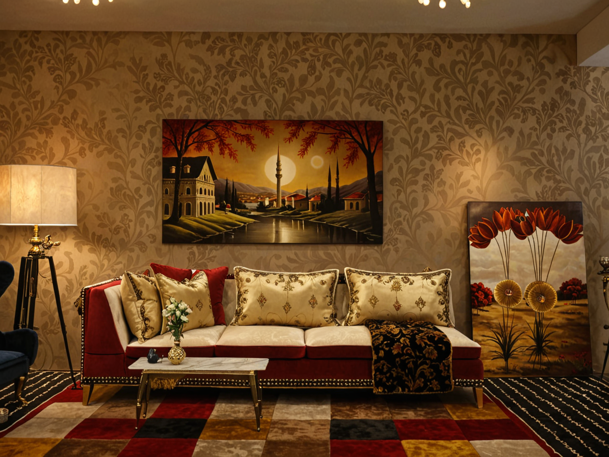
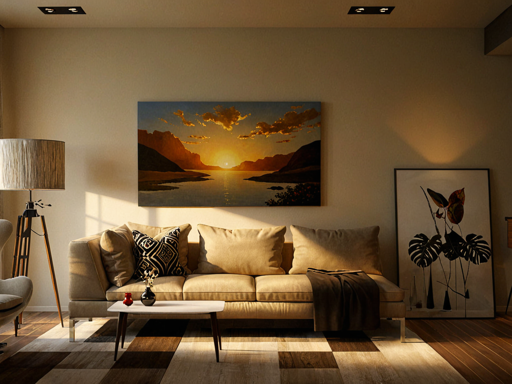

<a href="/">< Dizine dön</a> | <a href="/ornekler">< Örneklere dön</a>

# Yapay zeka ile üç boyutlu derinlikten iç mekan tasarımı

Bu örneğimizde varolan bir mekanı 3D derinlik haritası üzerinden üretken yapay zeka ile yeniden tasarlayacağız. Örneğimizde A1111 kullanacağız ve RealVis modelini kullanacağız.

Model indirme, controlnet  için sanat.ai üzerindeki dersler bölümümüze bakabilirsiniz.

İlk olarak referans olarak kullanacağımız oturma odası görselini seçiyoruz. 

Görselimizi Contrlnet fotoğraf alanında seçtikten sonra Depth modelini seçiyoruz. 

Dept modeli odamınız 3D ısı derinlik haritasını çıkarıyor.

Daha sonra prompt alanına 

`chinese living room,  ((best quality)),((masterpiece)),((realistic)), soft light, soft light`

Negatif prompt alanına ise 

`logo, text,word,cropped,low quality,normal quality,username,watermark,signature,blurry,soft,soft line,sketch,ugly,logo,pixelated,lowres, FastNegative`

yazıp diğer ayarları bu şekilde ayarlayarak görselimizi oluşturuyoruz.

Sonuçlarımız bu şekilde oldu.

Görselinizdeki herhangi bir alanı değiştirmek isterseniz bu yazımızın son kısmına bakabilirsiniz.[text](ic-mekan-tasarimi.md)

