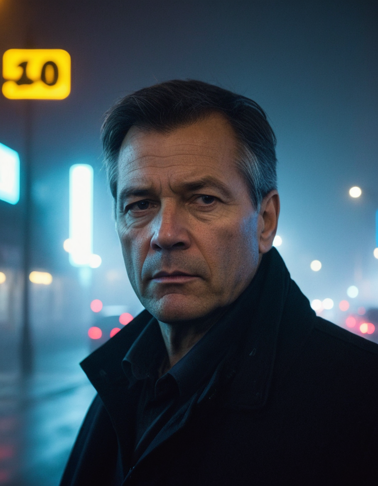

<a href="/">< Dizine dön</a> | <a href="/ornekler">< Örneklere dön</a>

# Ultra gerçekçi insan fotoğrafları oluşturma

Her geçen gün yapay zeka ile oluşturulan görselleri gerçek fotoğraflardan ayırt etmek daha da zor hale geliyor. Bu örneğimizde Stable Diffusion (ComfyUI) ve Midjourney ile ultra gerçekçi görseller üretmeyi konu olacağız.

# Stable Diffusion

Gerçekçi görseller için Stable Diffusion tarafında bir çok model olmakla birlikte biz örneğimizde iki farklı modeli kullanacağız bunlar;

1) RealVisXL https://civitai.com/models/139562

2) Epic Realizm https://civitai.com/models/277058/epicrealism-xl

1) Epic Realism kullanarak ilk örneğimizi oluşturalım;
Promptlar;
`(Soft Lighting Photography), Mirror selfie , a 40 year old gorgeous man with beard, slight smile , detailed skin face and eyes , natural lighting , at home , long hair, messy hair, cleavage, film grain, low contrast, natural face, dark blonde hair , dark blue eyes, dark circles under eyes` 

Negatif promptlarımız
`worst quality, extra fingers, missing fingers, poorly rendered hands, mutation, deformed iris, deformed pupils, deformed limbs, missing limbs, amputee, amputated limbs, watermark, logo , text, piercing, big eyes , teeth, cartoon, shallow depth of field, makeup` 

Sonucumuz;

ComfyUI Workflow
[text](../gorseller/workflow/ultra-realist-1.json)

2) Realvis kullanarak

Prompt;

`city street, neon, fog, volumetric, closeup photo of 50 y.o man in dark clothes, serious face` 

Negatif promptlarımız;

`(octane render, render, drawing, anime, bad photo, bad photography:1.3), (worst quality, low quality, blurry:1.2), (bad teeth, deformed teeth, deformed lips), (bad anatomy, bad proportions:1.1), (deformed iris, deformed pupils), (deformed eyes, bad eyes), (deformed face, ugly face, bad face), (deformed hands, bad hands, fused fingers), morbid, mutilated, mutation, disfigured` 

Sonucumuz;

ComfyUI Workflow
[text](../gorseller/workflow/ultra-realist-2.json)

# Midjourney

Midjourney için gerekli promptları paylaşıyoruz, şu an için en güncel versiyon olan 6. versiyonu kullandık.

`raft a photo-realistic portrait highlighting the naturalboy with sun-kissed freckles. Place him in a coastal setting during sunset, with soft waves creating a serene atmosphere. --ar 2:3 --stylize 350 --style raw --v 6.0`

`Design a lifelike portrayal of a turkish old woman with ethnic clothes, showcasing her joyous spirit. with the vibrant yellow blooms complementing her positive energy. --ar 9:16 --stylize 250 --style raw --v 6.0`

